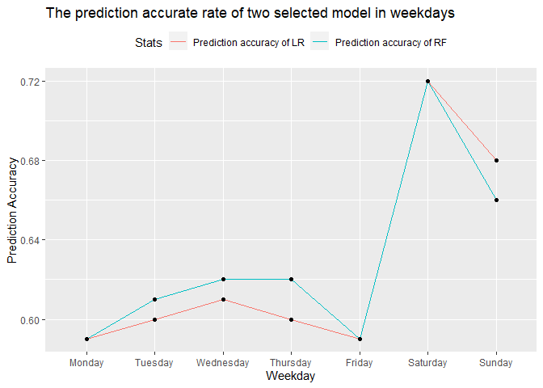

README
================
Tao Sun
2020-07-01

Random Forest model turns out to be the better model for prediction most
of the time except to data from Sunday, and it can achieve an accuracy
of 60% with optimal parameters here.

The analysis for [Monday is available here](MondayAnalysis.md).

The analysis for [Tuesday is available here](TuesdayAnalysis.md).

The analysis for [Wednesdayu is available here](WednesdayAnalysis.md).

The analysis for [Thursday is available here](ThursdayAnalysis.md).

The analysis for [Friday is available here](FridayAnalysis.md).

The analysis for [Saturday is available here](SaturdayAnalysis.md).

The analysis for [Sunday is available here](SundayAnalysis.md).

The project [Rmd file is here](ST558project2.Rmd)

The R code for [automation is here](knitr.R) or run blow chunk R code.

A table with some selected parameters are listed in below table,
weekend’s data prediction is more accurate and also generally need
less predictors and mTry.

The prediction accurate rate from two model is also compared in the
plot.

``` r
# To produce md output automatically - Need press "run current chunk".
# Create weekday parameter
weekdays <- c("Monday", "Tuesday", "Wednesday", "Thursday", "Friday", "Saturday", "Sunday")

# Create empty vector holders 
for (i in weekdays) {assign(i , rep(0 ,7))}

# Create summary dataset
if (!exists("resultSummary")) {
resultSummary <- dplyr::as_tibble(matrix(0, ncol=7,nrow=7,
                  dimnames = list(c("Total records #", "Training records #", 
                                    "Testing records #", "Features # in LR",
                                    "Prediction accuracy of LR", 
                                    "mTry in RF", 
                                    "Prediction accuracy of RF"),
                          c("Monday", "Tuesday", "Wednesday",
                            "Thursday", "Friday","Saturday", "Sunday"))), 
                  rownames= NA)  %>% rownames_to_column("Stats") 
}

# Create knitr automation parameter and out file names and put into a tibble
output_file <- paste0(weekdays, "Analysis.md")
params <- lapply(weekdays, FUN = function(x){list(weekday=x)})
reports <- tibble(output_file, params)

# Knit file and create reports automatically
apply(reports, MARGIN=1, 
      FUN=function(x){  # x[[1]] since tibble does not simplify.
        rmarkdown::render(input = "ST558project2.Rmd", output_file = x[[1]],
                          params = x[[2]], clean=FALSE, envir=new.env())
      })

# Collect all weekday data into dataframe
#for (day in weekdays) {
#         resultSummary[day] <- eval(parse(text=day))
#}
```

# Plot the model fitting parameters.

``` r
# Collect all weekday data into data frame
for (day in weekdays) {
         resultSummary[day] <- eval(parse(text=day))
}

knitr::kable(resultSummary, label="Summary of selected parameters from two select models")  # Create table
```

| Stats                     |  Monday | Tuesday | Wednesday | Thursday |  Friday | Saturday |  Sunday |
| :------------------------ | ------: | ------: | --------: | -------: | ------: | -------: | ------: |
| Total records \#          | 6661.00 | 7390.00 |   7435.00 |  7267.00 | 5701.00 |  2453.00 | 2737.00 |
| Training records \#       | 4664.00 | 5175.00 |   5207.00 |  5088.00 | 3993.00 |  1719.00 | 1917.00 |
| Testing records \#        | 1997.00 | 2215.00 |   2228.00 |  2179.00 | 1708.00 |   734.00 |  820.00 |
| Features \# in LR         |   25.00 |   29.00 |     27.00 |    22.00 |   19.00 |    23.00 |   21.00 |
| Prediction accuracy of LR |    0.59 |    0.60 |      0.61 |     0.60 |    0.59 |     0.72 |    0.68 |
| mTry in RF                |    8.00 |    8.00 |      8.00 |     8.00 |    8.00 |     2.00 |    2.00 |
| Prediction accuracy of RF |    0.59 |    0.61 |      0.62 |     0.62 |    0.59 |     0.72 |    0.66 |

``` r
# plot the prediction accurate rate for different weekday 
plotResult <- resultSummary[c(5,7),] %>%  gather(key="Weekday", value = "Prediction Accuracy", 2:8)
plotResult$Weekday <- factor(plotResult$Weekday, levels = c("Monday", "Tuesday", "Wednesday",
                            "Thursday", "Friday","Saturday", "Sunday"))

ggplot(data=plotResult, aes(x=Weekday, y=`Prediction Accuracy`, group=Stats)) + 
  geom_line(aes(col=Stats)) +
  geom_point() +
  theme(legend.position = "top") +
  labs(title="The prediction accurate rate of two selected model in weekdays")
```

<!-- -->

``` r
#rmarkdown::render("Knit.Rmd", "github_document")
```
