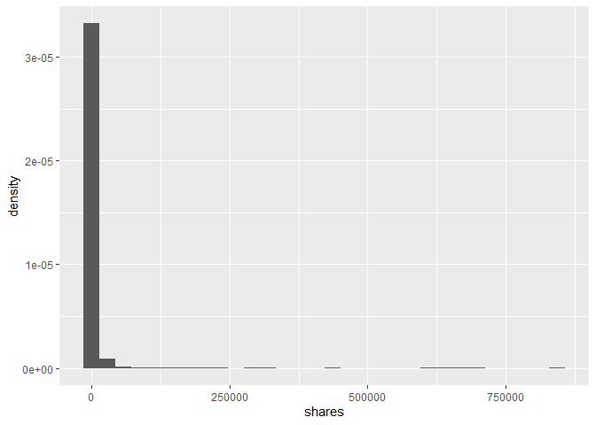

Project2
================
Tao Sun
6/25/2020

## 1\. Introduction

This

## 1\. Read in datasets and EDA

``` r
# download data file and read in to R.
news <- read_csv("OnlineNewsPopularity.csv")
```

    ## Parsed with column specification:
    ## cols(
    ##   .default = col_double(),
    ##   url = col_character()
    ## )

    ## See spec(...) for full column specifications.

``` r
#summary(news)
colnames(news)
```

    ##  [1] "url"                           "timedelta"                    
    ##  [3] "n_tokens_title"                "n_tokens_content"             
    ##  [5] "n_unique_tokens"               "n_non_stop_words"             
    ##  [7] "n_non_stop_unique_tokens"      "num_hrefs"                    
    ##  [9] "num_self_hrefs"                "num_imgs"                     
    ## [11] "num_videos"                    "average_token_length"         
    ## [13] "num_keywords"                  "data_channel_is_lifestyle"    
    ## [15] "data_channel_is_entertainment" "data_channel_is_bus"          
    ## [17] "data_channel_is_socmed"        "data_channel_is_tech"         
    ## [19] "data_channel_is_world"         "kw_min_min"                   
    ## [21] "kw_max_min"                    "kw_avg_min"                   
    ## [23] "kw_min_max"                    "kw_max_max"                   
    ## [25] "kw_avg_max"                    "kw_min_avg"                   
    ## [27] "kw_max_avg"                    "kw_avg_avg"                   
    ## [29] "self_reference_min_shares"     "self_reference_max_shares"    
    ## [31] "self_reference_avg_sharess"    "weekday_is_monday"            
    ## [33] "weekday_is_tuesday"            "weekday_is_wednesday"         
    ## [35] "weekday_is_thursday"           "weekday_is_friday"            
    ## [37] "weekday_is_saturday"           "weekday_is_sunday"            
    ## [39] "is_weekend"                    "LDA_00"                       
    ## [41] "LDA_01"                        "LDA_02"                       
    ## [43] "LDA_03"                        "LDA_04"                       
    ## [45] "global_subjectivity"           "global_sentiment_polarity"    
    ## [47] "global_rate_positive_words"    "global_rate_negative_words"   
    ## [49] "rate_positive_words"           "rate_negative_words"          
    ## [51] "avg_positive_polarity"         "min_positive_polarity"        
    ## [53] "max_positive_polarity"         "avg_negative_polarity"        
    ## [55] "min_negative_polarity"         "max_negative_polarity"        
    ## [57] "title_subjectivity"            "title_sentiment_polarity"     
    ## [59] "abs_title_subjectivity"        "abs_title_sentiment_polarity" 
    ## [61] "shares"

``` r
anyNA(news)             # Check missing values.
```

    ## [1] FALSE

``` r
# Because url and timedelta are not predictors, exclude them form the dataset.
fitData <- news %>% select(-c(url, timedelta))
```

## 2\. EDA

``` r
# Convert factor variables to factors
fitData$data_channel_is_lifestyle = as.factor(fitData$data_channel_is_lifestyle)
fitData$data_channel_is_entertainment = as.factor(fitData$data_channel_is_entertainment)
fitData$data_channel_is_bus = as.factor(fitData$data_channel_is_bus)
fitData$data_channel_is_socmed = as.factor(fitData$data_channel_is_socmed)
fitData$data_channel_is_tech = as.factor(fitData$data_channel_is_tech)
fitData$data_channel_is_world = as.factor(fitData$data_channel_is_world)

# plot shares histogram
fitData %>% ggplot(aes(x=shares, y=..density..))+geom_histogram()
```

    ## `stat_bin()` using `bins = 30`. Pick better value with `binwidth`.

<!-- -->

``` r
# Log transform shares.
fitData1 <- fitData %>% mutate(logShares = log(shares)) %>% select(-shares)
fitData1 %>% ggplot(aes(x=logShares))+geom_histogram(aes(y=..density..)) +
             stat_function(fun=dnorm, args=list(mean=mean(fitData1$logShares),
                                                sd=sd(fitData1$logShares)),
                           color = "red", size = 1)
```

    ## `stat_bin()` using `bins = 30`. Pick better value with `binwidth`.

<!-- -->

## 3\. Subset data

``` r
fitData2 <- fitData1 %>% filter(fitData[paste0("weekday_is_", params$weekday)]==1) %>% 
                        select(-contains("week")) 
                    
index <- createDataPartition(fitData2$logShares, p=0.70, list=FALSE)
training <- fitData2[ index,]
```

    ## Warning: The `i` argument of ``[`()` can't be a matrix as of tibble 3.0.0.
    ## Convert to a vector.
    ## This warning is displayed once every 8 hours.
    ## Call `lifecycle::last_warnings()` to see where this warning was generated.

``` r
testing  <- fitData2[-index,]

dim(fitData1); dim(training);dim(testing)
```

    ## [1] 39644    59

    ## [1] 3993   51

    ## [1] 1708   51

## 4\. linear regression to identify important predictors.

``` r
# fit the data in a full model with all predictors.
lrFit <- lm(logShares ~., data =training)
pred <- predict(lrFit, newdata = testing)
```

    ## Warning in predict.lm(lrFit, newdata = testing): prediction from a rank-
    ## deficient fit may be misleading

``` r
selectlrFit <- step(lrFit, direction="backward", trace=1, k=2)
```

    ## Start:  AIC=-1106.59
    ## logShares ~ n_tokens_title + n_tokens_content + n_unique_tokens + 
    ##     n_non_stop_words + n_non_stop_unique_tokens + num_hrefs + 
    ##     num_self_hrefs + num_imgs + num_videos + average_token_length + 
    ##     num_keywords + data_channel_is_lifestyle + data_channel_is_entertainment + 
    ##     data_channel_is_bus + data_channel_is_socmed + data_channel_is_tech + 
    ##     data_channel_is_world + kw_min_min + kw_max_min + kw_avg_min + 
    ##     kw_min_max + kw_max_max + kw_avg_max + kw_min_avg + kw_max_avg + 
    ##     kw_avg_avg + self_reference_min_shares + self_reference_max_shares + 
    ##     self_reference_avg_sharess + LDA_00 + LDA_01 + LDA_02 + LDA_03 + 
    ##     LDA_04 + global_subjectivity + global_sentiment_polarity + 
    ##     global_rate_positive_words + global_rate_negative_words + 
    ##     rate_positive_words + rate_negative_words + avg_positive_polarity + 
    ##     min_positive_polarity + max_positive_polarity + avg_negative_polarity + 
    ##     min_negative_polarity + max_negative_polarity + title_subjectivity + 
    ##     title_sentiment_polarity + abs_title_subjectivity + abs_title_sentiment_polarity
    ## 
    ## 
    ## Step:  AIC=-1106.59
    ## logShares ~ n_tokens_title + n_tokens_content + n_unique_tokens + 
    ##     n_non_stop_words + n_non_stop_unique_tokens + num_hrefs + 
    ##     num_self_hrefs + num_imgs + num_videos + average_token_length + 
    ##     num_keywords + data_channel_is_lifestyle + data_channel_is_entertainment + 
    ##     data_channel_is_bus + data_channel_is_socmed + data_channel_is_tech + 
    ##     data_channel_is_world + kw_min_min + kw_max_min + kw_avg_min + 
    ##     kw_min_max + kw_max_max + kw_avg_max + kw_min_avg + kw_max_avg + 
    ##     kw_avg_avg + self_reference_min_shares + self_reference_max_shares + 
    ##     self_reference_avg_sharess + LDA_00 + LDA_01 + LDA_02 + LDA_03 + 
    ##     LDA_04 + global_subjectivity + global_sentiment_polarity + 
    ##     global_rate_positive_words + global_rate_negative_words + 
    ##     rate_positive_words + avg_positive_polarity + min_positive_polarity + 
    ##     max_positive_polarity + avg_negative_polarity + min_negative_polarity + 
    ##     max_negative_polarity + title_subjectivity + title_sentiment_polarity + 
    ##     abs_title_subjectivity + abs_title_sentiment_polarity
    ## 
    ## 
    ## Step:  AIC=-1106.59
    ## logShares ~ n_tokens_title + n_tokens_content + n_unique_tokens + 
    ##     n_non_stop_words + n_non_stop_unique_tokens + num_hrefs + 
    ##     num_self_hrefs + num_imgs + num_videos + average_token_length + 
    ##     num_keywords + data_channel_is_lifestyle + data_channel_is_entertainment + 
    ##     data_channel_is_bus + data_channel_is_socmed + data_channel_is_tech + 
    ##     data_channel_is_world + kw_min_min + kw_max_min + kw_avg_min + 
    ##     kw_min_max + kw_max_max + kw_avg_max + kw_min_avg + kw_max_avg + 
    ##     kw_avg_avg + self_reference_min_shares + self_reference_max_shares + 
    ##     self_reference_avg_sharess + LDA_00 + LDA_01 + LDA_02 + LDA_03 + 
    ##     global_subjectivity + global_sentiment_polarity + global_rate_positive_words + 
    ##     global_rate_negative_words + rate_positive_words + avg_positive_polarity + 
    ##     min_positive_polarity + max_positive_polarity + avg_negative_polarity + 
    ##     min_negative_polarity + max_negative_polarity + title_subjectivity + 
    ##     title_sentiment_polarity + abs_title_subjectivity + abs_title_sentiment_polarity
    ## 
    ##                                 Df Sum of Sq    RSS      AIC
    ## - self_reference_max_shares      1     0.001 2953.1 -1108.59
    ## - average_token_length           1     0.039 2953.2 -1108.54
    ## - n_tokens_title                 1     0.061 2953.2 -1108.51
    ## - self_reference_min_shares      1     0.084 2953.2 -1108.47
    ## - n_tokens_content               1     0.107 2953.2 -1108.44
    ## - abs_title_sentiment_polarity   1     0.134 2953.3 -1108.41
    ## - num_self_hrefs                 1     0.134 2953.3 -1108.41
    ## - kw_max_max                     1     0.137 2953.3 -1108.40
    ## - num_imgs                       1     0.148 2953.3 -1108.39
    ## - n_non_stop_unique_tokens       1     0.191 2953.3 -1108.33
    ## - self_reference_avg_sharess     1     0.217 2953.3 -1108.29
    ## - kw_min_max                     1     0.298 2953.4 -1108.19
    ## - num_keywords                   1     0.328 2953.5 -1108.14
    ## - global_rate_negative_words     1     0.333 2953.5 -1108.14
    ## - n_non_stop_words               1     0.397 2953.5 -1108.05
    ## - num_videos                     1     0.411 2953.6 -1108.03
    ## - avg_positive_polarity          1     0.494 2953.6 -1107.92
    ## - LDA_01                         1     0.524 2953.7 -1107.88
    ## - kw_max_min                     1     0.618 2953.8 -1107.75
    ## - data_channel_is_tech           1     0.888 2954.0 -1107.39
    ## - n_unique_tokens                1     0.943 2954.1 -1107.31
    ## - kw_avg_max                     1     0.983 2954.1 -1107.26
    ## - max_positive_polarity          1     1.019 2954.2 -1107.21
    ## - title_subjectivity             1     1.039 2954.2 -1107.18
    ## - abs_title_subjectivity         1     1.153 2954.3 -1107.03
    ## - num_hrefs                      1     1.224 2954.4 -1106.93
    ## - data_channel_is_world          1     1.299 2954.4 -1106.83
    ## - LDA_03                         1     1.317 2954.4 -1106.81
    ## - min_negative_polarity          1     1.321 2954.5 -1106.80
    ## - global_rate_positive_words     1     1.462 2954.6 -1106.61
    ## <none>                                       2953.1 -1106.59
    ## - global_sentiment_polarity      1     1.623 2954.8 -1106.39
    ## - avg_negative_polarity          1     1.717 2954.8 -1106.27
    ## - global_subjectivity            1     1.880 2955.0 -1106.05
    ## - data_channel_is_lifestyle      1     1.915 2955.1 -1106.00
    ## - min_positive_polarity          1     1.963 2955.1 -1105.93
    ## - LDA_02                         1     2.072 2955.2 -1105.79
    ## - data_channel_is_socmed         1     2.098 2955.2 -1105.75
    ## - max_negative_polarity          1     2.886 2956.0 -1104.69
    ## - rate_positive_words            1     3.088 2956.2 -1104.41
    ## - LDA_00                         1     3.706 2956.8 -1103.58
    ## - title_sentiment_polarity       1     5.379 2958.5 -1101.32
    ## - data_channel_is_entertainment  1     5.753 2958.9 -1100.82
    ## - kw_avg_min                     1     5.952 2959.1 -1100.55
    ## - data_channel_is_bus            1     7.781 2960.9 -1098.08
    ## - kw_min_min                     1     9.019 2962.2 -1096.41
    ## - kw_min_avg                     1    20.796 2973.9 -1080.57
    ## - kw_max_avg                     1    36.536 2989.7 -1059.49
    ## - kw_avg_avg                     1    85.251 3038.4  -994.95
    ## 
    ## Step:  AIC=-1108.59
    ## logShares ~ n_tokens_title + n_tokens_content + n_unique_tokens + 
    ##     n_non_stop_words + n_non_stop_unique_tokens + num_hrefs + 
    ##     num_self_hrefs + num_imgs + num_videos + average_token_length + 
    ##     num_keywords + data_channel_is_lifestyle + data_channel_is_entertainment + 
    ##     data_channel_is_bus + data_channel_is_socmed + data_channel_is_tech + 
    ##     data_channel_is_world + kw_min_min + kw_max_min + kw_avg_min + 
    ##     kw_min_max + kw_max_max + kw_avg_max + kw_min_avg + kw_max_avg + 
    ##     kw_avg_avg + self_reference_min_shares + self_reference_avg_sharess + 
    ##     LDA_00 + LDA_01 + LDA_02 + LDA_03 + global_subjectivity + 
    ##     global_sentiment_polarity + global_rate_positive_words + 
    ##     global_rate_negative_words + rate_positive_words + avg_positive_polarity + 
    ##     min_positive_polarity + max_positive_polarity + avg_negative_polarity + 
    ##     min_negative_polarity + max_negative_polarity + title_subjectivity + 
    ##     title_sentiment_polarity + abs_title_subjectivity + abs_title_sentiment_polarity
    ## 
    ##                                 Df Sum of Sq    RSS      AIC
    ## - average_token_length           1     0.039 2953.2 -1110.53
    ## - n_tokens_title                 1     0.060 2953.2 -1110.51
    ## - n_tokens_content               1     0.108 2953.2 -1110.44
    ## - abs_title_sentiment_polarity   1     0.134 2953.3 -1110.41
    ## - num_self_hrefs                 1     0.136 2953.3 -1110.40
    ## - kw_max_max                     1     0.137 2953.3 -1110.40
    ## - self_reference_min_shares      1     0.138 2953.3 -1110.40
    ## - num_imgs                       1     0.148 2953.3 -1110.39
    ## - n_non_stop_unique_tokens       1     0.192 2953.3 -1110.33
    ## - kw_min_max                     1     0.299 2953.4 -1110.18
    ## - num_keywords                   1     0.329 2953.5 -1110.14
    ## - global_rate_negative_words     1     0.332 2953.5 -1110.14
    ## - n_non_stop_words               1     0.397 2953.5 -1110.05
    ## - num_videos                     1     0.449 2953.6 -1109.98
    ## - avg_positive_polarity          1     0.495 2953.6 -1109.92
    ## - LDA_01                         1     0.523 2953.7 -1109.88
    ## - kw_max_min                     1     0.618 2953.8 -1109.75
    ## - data_channel_is_tech           1     0.889 2954.0 -1109.39
    ## - n_unique_tokens                1     0.943 2954.1 -1109.31
    ## - kw_avg_max                     1     0.982 2954.1 -1109.26
    ## - max_positive_polarity          1     1.018 2954.2 -1109.21
    ## - title_subjectivity             1     1.038 2954.2 -1109.18
    ## - self_reference_avg_sharess     1     1.136 2954.3 -1109.05
    ## - abs_title_subjectivity         1     1.152 2954.3 -1109.03
    ## - num_hrefs                      1     1.241 2954.4 -1108.91
    ## - data_channel_is_world          1     1.298 2954.4 -1108.83
    ## - LDA_03                         1     1.319 2954.5 -1108.80
    ## - min_negative_polarity          1     1.324 2954.5 -1108.80
    ## - global_rate_positive_words     1     1.461 2954.6 -1108.61
    ## <none>                                       2953.1 -1108.59
    ## - global_sentiment_polarity      1     1.627 2954.8 -1108.39
    ## - avg_negative_polarity          1     1.721 2954.9 -1108.26
    ## - global_subjectivity            1     1.881 2955.0 -1108.04
    ## - data_channel_is_lifestyle      1     1.914 2955.1 -1108.00
    ## - min_positive_polarity          1     1.964 2955.1 -1107.93
    ## - LDA_02                         1     2.072 2955.2 -1107.79
    ## - data_channel_is_socmed         1     2.098 2955.2 -1107.75
    ## - max_negative_polarity          1     2.890 2956.0 -1106.68
    ## - rate_positive_words            1     3.088 2956.2 -1106.41
    ## - LDA_00                         1     3.707 2956.8 -1105.58
    ## - title_sentiment_polarity       1     5.381 2958.5 -1103.32
    ## - data_channel_is_entertainment  1     5.752 2958.9 -1102.82
    ## - kw_avg_min                     1     5.971 2959.1 -1102.52
    ## - data_channel_is_bus            1     7.782 2960.9 -1100.08
    ## - kw_min_min                     1     9.019 2962.2 -1098.41
    ## - kw_min_avg                     1    20.802 2973.9 -1082.56
    ## - kw_max_avg                     1    37.135 2990.3 -1060.69
    ## - kw_avg_avg                     1    85.350 3038.5  -996.82
    ## 
    ## Step:  AIC=-1110.53
    ## logShares ~ n_tokens_title + n_tokens_content + n_unique_tokens + 
    ##     n_non_stop_words + n_non_stop_unique_tokens + num_hrefs + 
    ##     num_self_hrefs + num_imgs + num_videos + num_keywords + data_channel_is_lifestyle + 
    ##     data_channel_is_entertainment + data_channel_is_bus + data_channel_is_socmed + 
    ##     data_channel_is_tech + data_channel_is_world + kw_min_min + 
    ##     kw_max_min + kw_avg_min + kw_min_max + kw_max_max + kw_avg_max + 
    ##     kw_min_avg + kw_max_avg + kw_avg_avg + self_reference_min_shares + 
    ##     self_reference_avg_sharess + LDA_00 + LDA_01 + LDA_02 + LDA_03 + 
    ##     global_subjectivity + global_sentiment_polarity + global_rate_positive_words + 
    ##     global_rate_negative_words + rate_positive_words + avg_positive_polarity + 
    ##     min_positive_polarity + max_positive_polarity + avg_negative_polarity + 
    ##     min_negative_polarity + max_negative_polarity + title_subjectivity + 
    ##     title_sentiment_polarity + abs_title_subjectivity + abs_title_sentiment_polarity
    ## 
    ##                                 Df Sum of Sq    RSS      AIC
    ## - n_tokens_title                 1     0.072 2953.2 -1112.44
    ## - n_tokens_content               1     0.108 2953.3 -1112.39
    ## - num_self_hrefs                 1     0.125 2953.3 -1112.37
    ## - self_reference_min_shares      1     0.134 2953.3 -1112.35
    ## - abs_title_sentiment_polarity   1     0.136 2953.3 -1112.35
    ## - kw_max_max                     1     0.138 2953.3 -1112.35
    ## - num_imgs                       1     0.147 2953.3 -1112.33
    ## - n_non_stop_unique_tokens       1     0.260 2953.4 -1112.18
    ## - kw_min_max                     1     0.303 2953.5 -1112.12
    ## - num_keywords                   1     0.337 2953.5 -1112.08
    ## - global_rate_negative_words     1     0.337 2953.5 -1112.08
    ## - num_videos                     1     0.467 2953.6 -1111.90
    ## - avg_positive_polarity          1     0.493 2953.7 -1111.87
    ## - LDA_01                         1     0.528 2953.7 -1111.82
    ## - kw_max_min                     1     0.611 2953.8 -1111.71
    ## - data_channel_is_tech           1     0.892 2954.1 -1111.33
    ## - kw_avg_max                     1     0.983 2954.2 -1111.21
    ## - max_positive_polarity          1     1.017 2954.2 -1111.16
    ## - title_subjectivity             1     1.046 2954.2 -1111.12
    ## - n_unique_tokens                1     1.137 2954.3 -1111.00
    ## - self_reference_avg_sharess     1     1.142 2954.3 -1110.99
    ## - abs_title_subjectivity         1     1.151 2954.3 -1110.98
    ## - num_hrefs                      1     1.203 2954.4 -1110.91
    ## - min_negative_polarity          1     1.317 2954.5 -1110.75
    ## - n_non_stop_words               1     1.317 2954.5 -1110.75
    ## - LDA_03                         1     1.318 2954.5 -1110.75
    ## - data_channel_is_world          1     1.332 2954.5 -1110.73
    ## - global_rate_positive_words     1     1.435 2954.6 -1110.59
    ## <none>                                       2953.2 -1110.53
    ## - global_sentiment_polarity      1     1.620 2954.8 -1110.34
    ## - avg_negative_polarity          1     1.718 2954.9 -1110.21
    ## - global_subjectivity            1     1.908 2955.1 -1109.96
    ## - data_channel_is_lifestyle      1     1.916 2955.1 -1109.94
    ## - min_positive_polarity          1     1.936 2955.1 -1109.92
    ## - data_channel_is_socmed         1     2.105 2955.3 -1109.69
    ## - LDA_02                         1     2.140 2955.3 -1109.64
    ## - max_negative_polarity          1     2.893 2956.1 -1108.62
    ## - rate_positive_words            1     3.087 2956.3 -1108.36
    ## - LDA_00                         1     3.677 2956.8 -1107.56
    ## - title_sentiment_polarity       1     5.403 2958.6 -1105.24
    ## - data_channel_is_entertainment  1     5.740 2958.9 -1104.78
    ## - kw_avg_min                     1     5.959 2959.1 -1104.48
    ## - data_channel_is_bus            1     7.818 2961.0 -1101.98
    ## - kw_min_min                     1     9.052 2962.2 -1100.31
    ## - kw_min_avg                     1    20.764 2973.9 -1084.56
    ## - kw_max_avg                     1    37.105 2990.3 -1062.68
    ## - kw_avg_avg                     1    85.321 3038.5  -998.81
    ## 
    ## Step:  AIC=-1112.44
    ## logShares ~ n_tokens_content + n_unique_tokens + n_non_stop_words + 
    ##     n_non_stop_unique_tokens + num_hrefs + num_self_hrefs + num_imgs + 
    ##     num_videos + num_keywords + data_channel_is_lifestyle + data_channel_is_entertainment + 
    ##     data_channel_is_bus + data_channel_is_socmed + data_channel_is_tech + 
    ##     data_channel_is_world + kw_min_min + kw_max_min + kw_avg_min + 
    ##     kw_min_max + kw_max_max + kw_avg_max + kw_min_avg + kw_max_avg + 
    ##     kw_avg_avg + self_reference_min_shares + self_reference_avg_sharess + 
    ##     LDA_00 + LDA_01 + LDA_02 + LDA_03 + global_subjectivity + 
    ##     global_sentiment_polarity + global_rate_positive_words + 
    ##     global_rate_negative_words + rate_positive_words + avg_positive_polarity + 
    ##     min_positive_polarity + max_positive_polarity + avg_negative_polarity + 
    ##     min_negative_polarity + max_negative_polarity + title_subjectivity + 
    ##     title_sentiment_polarity + abs_title_subjectivity + abs_title_sentiment_polarity
    ## 
    ##                                 Df Sum of Sq    RSS     AIC
    ## - n_tokens_content               1     0.111 2953.4 -1114.3
    ## - num_self_hrefs                 1     0.122 2953.4 -1114.3
    ## - self_reference_min_shares      1     0.132 2953.4 -1114.3
    ## - kw_max_max                     1     0.137 2953.4 -1114.2
    ## - abs_title_sentiment_polarity   1     0.139 2953.4 -1114.2
    ## - num_imgs                       1     0.143 2953.4 -1114.2
    ## - n_non_stop_unique_tokens       1     0.262 2953.5 -1114.1
    ## - kw_min_max                     1     0.313 2953.6 -1114.0
    ## - global_rate_negative_words     1     0.328 2953.6 -1114.0
    ## - num_keywords                   1     0.329 2953.6 -1114.0
    ## - num_videos                     1     0.473 2953.7 -1113.8
    ## - avg_positive_polarity          1     0.498 2953.8 -1113.8
    ## - LDA_01                         1     0.520 2953.8 -1113.7
    ## - kw_max_min                     1     0.610 2953.9 -1113.6
    ## - data_channel_is_tech           1     0.896 2954.1 -1113.2
    ## - kw_avg_max                     1     0.946 2954.2 -1113.2
    ## - max_positive_polarity          1     1.028 2954.3 -1113.0
    ## - title_subjectivity             1     1.061 2954.3 -1113.0
    ## - abs_title_subjectivity         1     1.101 2954.3 -1113.0
    ## - self_reference_avg_sharess     1     1.148 2954.4 -1112.9
    ## - n_unique_tokens                1     1.164 2954.4 -1112.9
    ## - num_hrefs                      1     1.165 2954.4 -1112.9
    ## - n_non_stop_words               1     1.289 2954.5 -1112.7
    ## - data_channel_is_world          1     1.304 2954.6 -1112.7
    ## - LDA_03                         1     1.314 2954.6 -1112.7
    ## - min_negative_polarity          1     1.320 2954.6 -1112.7
    ## - global_rate_positive_words     1     1.436 2954.7 -1112.5
    ## <none>                                       2953.2 -1112.4
    ## - global_sentiment_polarity      1     1.633 2954.9 -1112.2
    ## - avg_negative_polarity          1     1.734 2955.0 -1112.1
    ## - global_subjectivity            1     1.903 2955.2 -1111.9
    ## - data_channel_is_lifestyle      1     1.930 2955.2 -1111.8
    ## - min_positive_polarity          1     1.937 2955.2 -1111.8
    ## - data_channel_is_socmed         1     2.099 2955.3 -1111.6
    ## - LDA_02                         1     2.166 2955.4 -1111.5
    ## - max_negative_polarity          1     2.918 2956.2 -1110.5
    ## - rate_positive_words            1     3.067 2956.3 -1110.3
    ## - LDA_00                         1     3.644 2956.9 -1109.5
    ## - title_sentiment_polarity       1     5.385 2958.6 -1107.2
    ## - data_channel_is_entertainment  1     5.674 2958.9 -1106.8
    ## - kw_avg_min                     1     5.952 2959.2 -1106.4
    ## - data_channel_is_bus            1     7.786 2961.0 -1103.9
    ## - kw_min_min                     1     9.041 2962.3 -1102.2
    ## - kw_min_avg                     1    20.802 2974.1 -1086.4
    ## - kw_max_avg                     1    37.083 2990.3 -1064.6
    ## - kw_avg_avg                     1    85.297 3038.6 -1000.7
    ## 
    ## Step:  AIC=-1114.29
    ## logShares ~ n_unique_tokens + n_non_stop_words + n_non_stop_unique_tokens + 
    ##     num_hrefs + num_self_hrefs + num_imgs + num_videos + num_keywords + 
    ##     data_channel_is_lifestyle + data_channel_is_entertainment + 
    ##     data_channel_is_bus + data_channel_is_socmed + data_channel_is_tech + 
    ##     data_channel_is_world + kw_min_min + kw_max_min + kw_avg_min + 
    ##     kw_min_max + kw_max_max + kw_avg_max + kw_min_avg + kw_max_avg + 
    ##     kw_avg_avg + self_reference_min_shares + self_reference_avg_sharess + 
    ##     LDA_00 + LDA_01 + LDA_02 + LDA_03 + global_subjectivity + 
    ##     global_sentiment_polarity + global_rate_positive_words + 
    ##     global_rate_negative_words + rate_positive_words + avg_positive_polarity + 
    ##     min_positive_polarity + max_positive_polarity + avg_negative_polarity + 
    ##     min_negative_polarity + max_negative_polarity + title_subjectivity + 
    ##     title_sentiment_polarity + abs_title_subjectivity + abs_title_sentiment_polarity
    ## 
    ##                                 Df Sum of Sq    RSS     AIC
    ## - num_imgs                       1     0.093 2953.4 -1116.2
    ## - num_self_hrefs                 1     0.130 2953.5 -1116.1
    ## - self_reference_min_shares      1     0.131 2953.5 -1116.1
    ## - abs_title_sentiment_polarity   1     0.131 2953.5 -1116.1
    ## - kw_max_max                     1     0.141 2953.5 -1116.1
    ## - n_non_stop_unique_tokens       1     0.193 2953.6 -1116.0
    ## - kw_min_max                     1     0.305 2953.7 -1115.9
    ## - global_rate_negative_words     1     0.335 2953.7 -1115.8
    ## - num_keywords                   1     0.349 2953.7 -1115.8
    ## - num_videos                     1     0.438 2953.8 -1115.7
    ## - avg_positive_polarity          1     0.496 2953.8 -1115.6
    ## - LDA_01                         1     0.513 2953.9 -1115.6
    ## - kw_max_min                     1     0.604 2954.0 -1115.5
    ## - data_channel_is_tech           1     0.914 2954.3 -1115.0
    ## - max_positive_polarity          1     0.983 2954.3 -1115.0
    ## - kw_avg_max                     1     0.997 2954.4 -1114.9
    ## - title_subjectivity             1     1.048 2954.4 -1114.9
    ## - num_hrefs                      1     1.063 2954.4 -1114.8
    ## - abs_title_subjectivity         1     1.103 2954.5 -1114.8
    ## - n_unique_tokens                1     1.106 2954.5 -1114.8
    ## - self_reference_avg_sharess     1     1.156 2954.5 -1114.7
    ## - min_negative_polarity          1     1.212 2954.6 -1114.7
    ## - LDA_03                         1     1.290 2954.7 -1114.5
    ## - data_channel_is_world          1     1.294 2954.7 -1114.5
    ## <none>                                       2953.4 -1114.3
    ## - global_rate_positive_words     1     1.499 2954.9 -1114.3
    ## - n_non_stop_words               1     1.567 2954.9 -1114.2
    ## - global_sentiment_polarity      1     1.590 2954.9 -1114.1
    ## - avg_negative_polarity          1     1.633 2955.0 -1114.1
    ## - global_subjectivity            1     1.902 2955.3 -1113.7
    ## - data_channel_is_lifestyle      1     1.913 2955.3 -1113.7
    ## - min_positive_polarity          1     1.949 2955.3 -1113.7
    ## - data_channel_is_socmed         1     2.091 2955.4 -1113.5
    ## - LDA_02                         1     2.172 2955.5 -1113.3
    ## - max_negative_polarity          1     2.846 2956.2 -1112.4
    ## - rate_positive_words            1     3.052 2956.4 -1112.2
    ## - LDA_00                         1     3.628 2957.0 -1111.4
    ## - title_sentiment_polarity       1     5.378 2958.7 -1109.0
    ## - data_channel_is_entertainment  1     5.815 2959.2 -1108.4
    ## - kw_avg_min                     1     5.954 2959.3 -1108.2
    ## - data_channel_is_bus            1     7.765 2961.1 -1105.8
    ## - kw_min_min                     1     9.027 2962.4 -1104.1
    ## - kw_min_avg                     1    20.932 2974.3 -1088.1
    ## - kw_max_avg                     1    37.259 2990.6 -1066.2
    ## - kw_avg_avg                     1    85.884 3039.2 -1001.8
    ## 
    ## Step:  AIC=-1116.16
    ## logShares ~ n_unique_tokens + n_non_stop_words + n_non_stop_unique_tokens + 
    ##     num_hrefs + num_self_hrefs + num_videos + num_keywords + 
    ##     data_channel_is_lifestyle + data_channel_is_entertainment + 
    ##     data_channel_is_bus + data_channel_is_socmed + data_channel_is_tech + 
    ##     data_channel_is_world + kw_min_min + kw_max_min + kw_avg_min + 
    ##     kw_min_max + kw_max_max + kw_avg_max + kw_min_avg + kw_max_avg + 
    ##     kw_avg_avg + self_reference_min_shares + self_reference_avg_sharess + 
    ##     LDA_00 + LDA_01 + LDA_02 + LDA_03 + global_subjectivity + 
    ##     global_sentiment_polarity + global_rate_positive_words + 
    ##     global_rate_negative_words + rate_positive_words + avg_positive_polarity + 
    ##     min_positive_polarity + max_positive_polarity + avg_negative_polarity + 
    ##     min_negative_polarity + max_negative_polarity + title_subjectivity + 
    ##     title_sentiment_polarity + abs_title_subjectivity + abs_title_sentiment_polarity
    ## 
    ##                                 Df Sum of Sq    RSS     AIC
    ## - num_self_hrefs                 1     0.122 2953.6 -1118.0
    ## - self_reference_min_shares      1     0.129 2953.6 -1118.0
    ## - abs_title_sentiment_polarity   1     0.135 2953.6 -1118.0
    ## - n_non_stop_unique_tokens       1     0.135 2953.6 -1118.0
    ## - kw_max_max                     1     0.151 2953.6 -1118.0
    ## - kw_min_max                     1     0.301 2953.8 -1117.8
    ## - global_rate_negative_words     1     0.330 2953.8 -1117.7
    ## - num_keywords                   1     0.353 2953.8 -1117.7
    ## - num_videos                     1     0.376 2953.8 -1117.7
    ## - LDA_01                         1     0.494 2953.9 -1117.5
    ## - avg_positive_polarity          1     0.508 2954.0 -1117.5
    ## - kw_max_min                     1     0.608 2954.1 -1117.3
    ## - data_channel_is_tech           1     0.908 2954.4 -1116.9
    ## - max_positive_polarity          1     1.008 2954.5 -1116.8
    ## - kw_avg_max                     1     1.023 2954.5 -1116.8
    ## - title_subjectivity             1     1.045 2954.5 -1116.8
    ## - n_unique_tokens                1     1.045 2954.5 -1116.8
    ## - abs_title_subjectivity         1     1.097 2954.6 -1116.7
    ## - num_hrefs                      1     1.144 2954.6 -1116.6
    ## - self_reference_avg_sharess     1     1.161 2954.6 -1116.6
    ## - min_negative_polarity          1     1.249 2954.7 -1116.5
    ## - LDA_03                         1     1.259 2954.7 -1116.5
    ## - data_channel_is_world          1     1.306 2954.8 -1116.4
    ## - n_non_stop_words               1     1.477 2954.9 -1116.2
    ## <none>                                       2953.4 -1116.2
    ## - global_rate_positive_words     1     1.519 2955.0 -1116.1
    ## - global_sentiment_polarity      1     1.605 2955.1 -1116.0
    ## - avg_negative_polarity          1     1.661 2955.1 -1115.9
    ## - global_subjectivity            1     1.907 2955.4 -1115.6
    ## - data_channel_is_lifestyle      1     1.940 2955.4 -1115.5
    ## - min_positive_polarity          1     1.971 2955.4 -1115.5
    ## - data_channel_is_socmed         1     2.067 2955.5 -1115.4
    ## - LDA_02                         1     2.180 2955.6 -1115.2
    ## - max_negative_polarity          1     2.845 2956.3 -1114.3
    ## - rate_positive_words            1     3.043 2956.5 -1114.0
    ## - LDA_00                         1     3.621 2957.1 -1113.3
    ## - title_sentiment_polarity       1     5.480 2958.9 -1110.8
    ## - data_channel_is_entertainment  1     5.819 2959.3 -1110.3
    ## - kw_avg_min                     1     5.997 2959.4 -1110.1
    ## - data_channel_is_bus            1     7.827 2961.3 -1107.6
    ## - kw_min_min                     1     9.109 2962.6 -1105.9
    ## - kw_min_avg                     1    21.006 2974.5 -1089.9
    ## - kw_max_avg                     1    37.584 2991.0 -1067.7
    ## - kw_avg_avg                     1    87.001 3040.4 -1002.2
    ## 
    ## Step:  AIC=-1118
    ## logShares ~ n_unique_tokens + n_non_stop_words + n_non_stop_unique_tokens + 
    ##     num_hrefs + num_videos + num_keywords + data_channel_is_lifestyle + 
    ##     data_channel_is_entertainment + data_channel_is_bus + data_channel_is_socmed + 
    ##     data_channel_is_tech + data_channel_is_world + kw_min_min + 
    ##     kw_max_min + kw_avg_min + kw_min_max + kw_max_max + kw_avg_max + 
    ##     kw_min_avg + kw_max_avg + kw_avg_avg + self_reference_min_shares + 
    ##     self_reference_avg_sharess + LDA_00 + LDA_01 + LDA_02 + LDA_03 + 
    ##     global_subjectivity + global_sentiment_polarity + global_rate_positive_words + 
    ##     global_rate_negative_words + rate_positive_words + avg_positive_polarity + 
    ##     min_positive_polarity + max_positive_polarity + avg_negative_polarity + 
    ##     min_negative_polarity + max_negative_polarity + title_subjectivity + 
    ##     title_sentiment_polarity + abs_title_subjectivity + abs_title_sentiment_polarity
    ## 
    ##                                 Df Sum of Sq    RSS     AIC
    ## - n_non_stop_unique_tokens       1     0.132 2953.7 -1119.8
    ## - abs_title_sentiment_polarity   1     0.133 2953.7 -1119.8
    ## - self_reference_min_shares      1     0.150 2953.7 -1119.8
    ## - kw_max_max                     1     0.155 2953.7 -1119.8
    ## - kw_min_max                     1     0.294 2953.9 -1119.6
    ## - global_rate_negative_words     1     0.335 2953.9 -1119.5
    ## - num_videos                     1     0.344 2953.9 -1119.5
    ## - num_keywords                   1     0.379 2953.9 -1119.5
    ## - LDA_01                         1     0.489 2954.1 -1119.3
    ## - avg_positive_polarity          1     0.498 2954.1 -1119.3
    ## - kw_max_min                     1     0.612 2954.2 -1119.2
    ## - data_channel_is_tech           1     0.875 2954.4 -1118.8
    ## - n_unique_tokens                1     1.019 2954.6 -1118.6
    ## - max_positive_polarity          1     1.021 2954.6 -1118.6
    ## - num_hrefs                      1     1.024 2954.6 -1118.6
    ## - title_subjectivity             1     1.043 2954.6 -1118.6
    ## - kw_avg_max                     1     1.061 2954.6 -1118.6
    ## - abs_title_subjectivity         1     1.085 2954.7 -1118.5
    ## - self_reference_avg_sharess     1     1.110 2954.7 -1118.5
    ## - LDA_03                         1     1.245 2954.8 -1118.3
    ## - min_negative_polarity          1     1.253 2954.8 -1118.3
    ## - data_channel_is_world          1     1.296 2954.9 -1118.2
    ## <none>                                       2953.6 -1118.0
    ## - n_non_stop_words               1     1.539 2955.1 -1117.9
    ## - global_rate_positive_words     1     1.555 2955.1 -1117.9
    ## - global_sentiment_polarity      1     1.575 2955.2 -1117.9
    ## - avg_negative_polarity          1     1.647 2955.2 -1117.8
    ## - data_channel_is_lifestyle      1     1.906 2955.5 -1117.4
    ## - min_positive_polarity          1     1.971 2955.5 -1117.3
    ## - global_subjectivity            1     1.977 2955.6 -1117.3
    ## - data_channel_is_socmed         1     2.031 2955.6 -1117.2
    ## - LDA_02                         1     2.143 2955.7 -1117.1
    ## - max_negative_polarity          1     2.816 2956.4 -1116.2
    ## - rate_positive_words            1     3.040 2956.6 -1115.9
    ## - LDA_00                         1     3.638 2957.2 -1115.1
    ## - title_sentiment_polarity       1     5.456 2959.0 -1112.6
    ## - data_channel_is_entertainment  1     5.872 2959.4 -1112.1
    ## - kw_avg_min                     1     6.026 2959.6 -1111.9
    ## - data_channel_is_bus            1     7.825 2961.4 -1109.4
    ## - kw_min_min                     1     9.136 2962.7 -1107.7
    ## - kw_min_avg                     1    21.521 2975.1 -1091.0
    ## - kw_max_avg                     1    37.772 2991.3 -1069.3
    ## - kw_avg_avg                     1    87.835 3041.4 -1003.0
    ## 
    ## Step:  AIC=-1119.82
    ## logShares ~ n_unique_tokens + n_non_stop_words + num_hrefs + 
    ##     num_videos + num_keywords + data_channel_is_lifestyle + data_channel_is_entertainment + 
    ##     data_channel_is_bus + data_channel_is_socmed + data_channel_is_tech + 
    ##     data_channel_is_world + kw_min_min + kw_max_min + kw_avg_min + 
    ##     kw_min_max + kw_max_max + kw_avg_max + kw_min_avg + kw_max_avg + 
    ##     kw_avg_avg + self_reference_min_shares + self_reference_avg_sharess + 
    ##     LDA_00 + LDA_01 + LDA_02 + LDA_03 + global_subjectivity + 
    ##     global_sentiment_polarity + global_rate_positive_words + 
    ##     global_rate_negative_words + rate_positive_words + avg_positive_polarity + 
    ##     min_positive_polarity + max_positive_polarity + avg_negative_polarity + 
    ##     min_negative_polarity + max_negative_polarity + title_subjectivity + 
    ##     title_sentiment_polarity + abs_title_subjectivity + abs_title_sentiment_polarity
    ## 
    ##                                 Df Sum of Sq    RSS     AIC
    ## - abs_title_sentiment_polarity   1     0.141 2953.8 -1121.6
    ## - self_reference_min_shares      1     0.149 2953.9 -1121.6
    ## - kw_max_max                     1     0.155 2953.9 -1121.6
    ## - kw_min_max                     1     0.299 2954.0 -1121.4
    ## - global_rate_negative_words     1     0.317 2954.0 -1121.4
    ## - num_videos                     1     0.354 2954.1 -1121.3
    ## - num_keywords                   1     0.398 2954.1 -1121.3
    ## - avg_positive_polarity          1     0.505 2954.2 -1121.1
    ## - LDA_01                         1     0.507 2954.2 -1121.1
    ## - kw_max_min                     1     0.603 2954.3 -1121.0
    ## - num_hrefs                      1     0.911 2954.6 -1120.6
    ## - data_channel_is_tech           1     0.925 2954.6 -1120.6
    ## - title_subjectivity             1     1.045 2954.8 -1120.4
    ## - kw_avg_max                     1     1.052 2954.8 -1120.4
    ## - abs_title_subjectivity         1     1.111 2954.8 -1120.3
    ## - self_reference_avg_sharess     1     1.117 2954.8 -1120.3
    ## - max_positive_polarity          1     1.121 2954.8 -1120.3
    ## - data_channel_is_world          1     1.239 2954.9 -1120.1
    ## - LDA_03                         1     1.317 2955.0 -1120.0
    ## - n_non_stop_words               1     1.426 2955.1 -1119.9
    ## - min_negative_polarity          1     1.440 2955.2 -1119.9
    ## <none>                                       2953.7 -1119.8
    ## - global_rate_positive_words     1     1.509 2955.2 -1119.8
    ## - global_sentiment_polarity      1     1.598 2955.3 -1119.7
    ## - avg_negative_polarity          1     1.706 2955.4 -1119.5
    ## - data_channel_is_lifestyle      1     1.814 2955.5 -1119.4
    ## - global_subjectivity            1     1.995 2955.7 -1119.1
    ## - data_channel_is_socmed         1     2.093 2955.8 -1119.0
    ## - min_positive_polarity          1     2.124 2955.8 -1119.0
    ## - n_unique_tokens                1     2.156 2955.9 -1118.9
    ## - LDA_02                         1     2.163 2955.9 -1118.9
    ## - max_negative_polarity          1     2.766 2956.5 -1118.1
    ## - rate_positive_words            1     3.003 2956.7 -1117.8
    ## - LDA_00                         1     3.640 2957.3 -1116.9
    ## - title_sentiment_polarity       1     5.472 2959.2 -1114.4
    ## - data_channel_is_entertainment  1     5.767 2959.5 -1114.0
    ## - kw_avg_min                     1     5.983 2959.7 -1113.7
    ## - data_channel_is_bus            1     7.719 2961.4 -1111.4
    ## - kw_min_min                     1     9.134 2962.8 -1109.5
    ## - kw_min_avg                     1    21.500 2975.2 -1092.9
    ## - kw_max_avg                     1    37.704 2991.4 -1071.2
    ## - kw_avg_avg                     1    87.706 3041.4 -1005.0
    ## 
    ## Step:  AIC=-1121.63
    ## logShares ~ n_unique_tokens + n_non_stop_words + num_hrefs + 
    ##     num_videos + num_keywords + data_channel_is_lifestyle + data_channel_is_entertainment + 
    ##     data_channel_is_bus + data_channel_is_socmed + data_channel_is_tech + 
    ##     data_channel_is_world + kw_min_min + kw_max_min + kw_avg_min + 
    ##     kw_min_max + kw_max_max + kw_avg_max + kw_min_avg + kw_max_avg + 
    ##     kw_avg_avg + self_reference_min_shares + self_reference_avg_sharess + 
    ##     LDA_00 + LDA_01 + LDA_02 + LDA_03 + global_subjectivity + 
    ##     global_sentiment_polarity + global_rate_positive_words + 
    ##     global_rate_negative_words + rate_positive_words + avg_positive_polarity + 
    ##     min_positive_polarity + max_positive_polarity + avg_negative_polarity + 
    ##     min_negative_polarity + max_negative_polarity + title_subjectivity + 
    ##     title_sentiment_polarity + abs_title_subjectivity
    ## 
    ##                                 Df Sum of Sq    RSS     AIC
    ## - kw_max_max                     1     0.148 2954.0 -1123.4
    ## - self_reference_min_shares      1     0.151 2954.0 -1123.4
    ## - kw_min_max                     1     0.288 2954.1 -1123.2
    ## - global_rate_negative_words     1     0.308 2954.2 -1123.2
    ## - num_videos                     1     0.359 2954.2 -1123.1
    ## - num_keywords                   1     0.404 2954.2 -1123.1
    ## - avg_positive_polarity          1     0.472 2954.3 -1123.0
    ## - LDA_01                         1     0.503 2954.3 -1123.0
    ## - kw_max_min                     1     0.608 2954.5 -1122.8
    ## - num_hrefs                      1     0.914 2954.8 -1122.4
    ## - data_channel_is_tech           1     0.945 2954.8 -1122.3
    ## - title_subjectivity             1     1.040 2954.9 -1122.2
    ## - kw_avg_max                     1     1.048 2954.9 -1122.2
    ## - self_reference_avg_sharess     1     1.106 2954.9 -1122.1
    ## - max_positive_polarity          1     1.140 2955.0 -1122.1
    ## - abs_title_subjectivity         1     1.143 2955.0 -1122.1
    ## - data_channel_is_world          1     1.261 2955.1 -1121.9
    ## - LDA_03                         1     1.312 2955.2 -1121.8
    ## - n_non_stop_words               1     1.403 2955.2 -1121.7
    ## - min_negative_polarity          1     1.457 2955.3 -1121.7
    ## <none>                                       2953.8 -1121.6
    ## - global_rate_positive_words     1     1.494 2955.3 -1121.6
    ## - global_sentiment_polarity      1     1.580 2955.4 -1121.5
    ## - avg_negative_polarity          1     1.754 2955.6 -1121.3
    ## - data_channel_is_lifestyle      1     1.801 2955.7 -1121.2
    ## - global_subjectivity            1     2.006 2955.8 -1120.9
    ## - data_channel_is_socmed         1     2.086 2955.9 -1120.8
    ## - LDA_02                         1     2.106 2955.9 -1120.8
    ## - min_positive_polarity          1     2.116 2956.0 -1120.8
    ## - n_unique_tokens                1     2.140 2956.0 -1120.7
    ## - max_negative_polarity          1     2.806 2956.7 -1119.8
    ## - rate_positive_words            1     2.988 2956.8 -1119.6
    ## - LDA_00                         1     3.628 2957.5 -1118.7
    ## - title_sentiment_polarity       1     5.542 2959.4 -1116.1
    ## - data_channel_is_entertainment  1     5.751 2959.6 -1115.9
    ## - kw_avg_min                     1     6.001 2959.8 -1115.5
    ## - data_channel_is_bus            1     7.667 2961.5 -1113.3
    ## - kw_min_min                     1     9.100 2962.9 -1111.3
    ## - kw_min_avg                     1    21.566 2975.4 -1094.6
    ## - kw_max_avg                     1    37.925 2991.8 -1072.7
    ## - kw_avg_avg                     1    88.014 3041.9 -1006.4
    ## 
    ## Step:  AIC=-1123.43
    ## logShares ~ n_unique_tokens + n_non_stop_words + num_hrefs + 
    ##     num_videos + num_keywords + data_channel_is_lifestyle + data_channel_is_entertainment + 
    ##     data_channel_is_bus + data_channel_is_socmed + data_channel_is_tech + 
    ##     data_channel_is_world + kw_min_min + kw_max_min + kw_avg_min + 
    ##     kw_min_max + kw_avg_max + kw_min_avg + kw_max_avg + kw_avg_avg + 
    ##     self_reference_min_shares + self_reference_avg_sharess + 
    ##     LDA_00 + LDA_01 + LDA_02 + LDA_03 + global_subjectivity + 
    ##     global_sentiment_polarity + global_rate_positive_words + 
    ##     global_rate_negative_words + rate_positive_words + avg_positive_polarity + 
    ##     min_positive_polarity + max_positive_polarity + avg_negative_polarity + 
    ##     min_negative_polarity + max_negative_polarity + title_subjectivity + 
    ##     title_sentiment_polarity + abs_title_subjectivity
    ## 
    ##                                 Df Sum of Sq    RSS     AIC
    ## - self_reference_min_shares      1     0.160 2954.2 -1125.2
    ## - global_rate_negative_words     1     0.307 2954.3 -1125.0
    ## - num_keywords                   1     0.341 2954.3 -1125.0
    ## - kw_min_max                     1     0.346 2954.3 -1125.0
    ## - num_videos                     1     0.355 2954.3 -1125.0
    ## - avg_positive_polarity          1     0.460 2954.5 -1124.8
    ## - LDA_01                         1     0.494 2954.5 -1124.8
    ## - kw_max_min                     1     0.620 2954.6 -1124.6
    ## - kw_avg_max                     1     0.901 2954.9 -1124.2
    ## - num_hrefs                      1     0.924 2954.9 -1124.2
    ## - data_channel_is_tech           1     0.988 2955.0 -1124.1
    ## - title_subjectivity             1     1.025 2955.0 -1124.0
    ## - self_reference_avg_sharess     1     1.081 2955.1 -1124.0
    ## - abs_title_subjectivity         1     1.141 2955.1 -1123.9
    ## - max_positive_polarity          1     1.158 2955.2 -1123.9
    ## - data_channel_is_world          1     1.188 2955.2 -1123.8
    ## - LDA_03                         1     1.368 2955.4 -1123.6
    ## - n_non_stop_words               1     1.374 2955.4 -1123.6
    ## <none>                                       2954.0 -1123.4
    ## - min_negative_polarity          1     1.483 2955.5 -1123.4
    ## - global_rate_positive_words     1     1.501 2955.5 -1123.4
    ## - global_sentiment_polarity      1     1.577 2955.6 -1123.3
    ## - data_channel_is_lifestyle      1     1.755 2955.8 -1123.0
    ## - avg_negative_polarity          1     1.773 2955.8 -1123.0
    ## - global_subjectivity            1     1.994 2956.0 -1122.7
    ## - min_positive_polarity          1     2.101 2956.1 -1122.6
    ## - LDA_02                         1     2.134 2956.1 -1122.5
    ## - n_unique_tokens                1     2.162 2956.2 -1122.5
    ## - data_channel_is_socmed         1     2.191 2956.2 -1122.5
    ## - max_negative_polarity          1     2.834 2956.8 -1121.6
    ## - rate_positive_words            1     2.983 2957.0 -1121.4
    ## - LDA_00                         1     3.613 2957.6 -1120.5
    ## - title_sentiment_polarity       1     5.507 2959.5 -1118.0
    ## - data_channel_is_entertainment  1     5.621 2959.6 -1117.8
    ## - kw_avg_min                     1     6.059 2960.1 -1117.2
    ## - data_channel_is_bus            1     7.628 2961.6 -1115.1
    ## - kw_min_min                     1    18.649 2972.7 -1100.3
    ## - kw_min_avg                     1    21.683 2975.7 -1096.2
    ## - kw_max_avg                     1    38.116 2992.1 -1074.2
    ## - kw_avg_avg                     1    88.662 3042.7 -1007.3
    ## 
    ## Step:  AIC=-1125.21
    ## logShares ~ n_unique_tokens + n_non_stop_words + num_hrefs + 
    ##     num_videos + num_keywords + data_channel_is_lifestyle + data_channel_is_entertainment + 
    ##     data_channel_is_bus + data_channel_is_socmed + data_channel_is_tech + 
    ##     data_channel_is_world + kw_min_min + kw_max_min + kw_avg_min + 
    ##     kw_min_max + kw_avg_max + kw_min_avg + kw_max_avg + kw_avg_avg + 
    ##     self_reference_avg_sharess + LDA_00 + LDA_01 + LDA_02 + LDA_03 + 
    ##     global_subjectivity + global_sentiment_polarity + global_rate_positive_words + 
    ##     global_rate_negative_words + rate_positive_words + avg_positive_polarity + 
    ##     min_positive_polarity + max_positive_polarity + avg_negative_polarity + 
    ##     min_negative_polarity + max_negative_polarity + title_subjectivity + 
    ##     title_sentiment_polarity + abs_title_subjectivity
    ## 
    ##                                 Df Sum of Sq    RSS     AIC
    ## - global_rate_negative_words     1     0.312 2954.5 -1126.8
    ## - num_videos                     1     0.322 2954.5 -1126.8
    ## - num_keywords                   1     0.339 2954.5 -1126.8
    ## - kw_min_max                     1     0.344 2954.5 -1126.8
    ## - avg_positive_polarity          1     0.464 2954.6 -1126.6
    ## - LDA_01                         1     0.502 2954.7 -1126.5
    ## - kw_max_min                     1     0.578 2954.7 -1126.4
    ## - num_hrefs                      1     0.896 2955.1 -1126.0
    ## - kw_avg_max                     1     0.907 2955.1 -1126.0
    ## - data_channel_is_tech           1     0.961 2955.1 -1125.9
    ## - title_subjectivity             1     1.034 2955.2 -1125.8
    ## - abs_title_subjectivity         1     1.162 2955.3 -1125.6
    ## - max_positive_polarity          1     1.174 2955.3 -1125.6
    ## - data_channel_is_world          1     1.198 2955.3 -1125.6
    ## - LDA_03                         1     1.367 2955.5 -1125.4
    ## - n_non_stop_words               1     1.391 2955.6 -1125.3
    ## - min_negative_polarity          1     1.474 2955.6 -1125.2
    ## <none>                                       2954.2 -1125.2
    ## - global_rate_positive_words     1     1.523 2955.7 -1125.2
    ## - global_sentiment_polarity      1     1.568 2955.7 -1125.1
    ## - avg_negative_polarity          1     1.767 2955.9 -1124.8
    ## - data_channel_is_lifestyle      1     1.771 2955.9 -1124.8
    ## - global_subjectivity            1     1.988 2956.1 -1124.5
    ## - min_positive_polarity          1     2.139 2956.3 -1124.3
    ## - n_unique_tokens                1     2.144 2956.3 -1124.3
    ## - data_channel_is_socmed         1     2.161 2956.3 -1124.3
    ## - LDA_02                         1     2.163 2956.3 -1124.3
    ## - max_negative_polarity          1     2.838 2957.0 -1123.4
    ## - rate_positive_words            1     2.998 2957.2 -1123.2
    ## - LDA_00                         1     3.585 2957.7 -1122.4
    ## - title_sentiment_polarity       1     5.534 2959.7 -1119.7
    ## - data_channel_is_entertainment  1     5.685 2959.8 -1119.5
    ## - kw_avg_min                     1     5.931 2960.1 -1119.2
    ## - self_reference_avg_sharess     1     6.998 2961.2 -1117.8
    ## - data_channel_is_bus            1     7.685 2961.8 -1116.8
    ## - kw_min_min                     1    18.565 2972.7 -1102.2
    ## - kw_min_avg                     1    21.650 2975.8 -1098.0
    ## - kw_max_avg                     1    38.748 2992.9 -1075.2
    ## - kw_avg_avg                     1    88.603 3042.8 -1009.2
    ## 
    ## Step:  AIC=-1126.79
    ## logShares ~ n_unique_tokens + n_non_stop_words + num_hrefs + 
    ##     num_videos + num_keywords + data_channel_is_lifestyle + data_channel_is_entertainment + 
    ##     data_channel_is_bus + data_channel_is_socmed + data_channel_is_tech + 
    ##     data_channel_is_world + kw_min_min + kw_max_min + kw_avg_min + 
    ##     kw_min_max + kw_avg_max + kw_min_avg + kw_max_avg + kw_avg_avg + 
    ##     self_reference_avg_sharess + LDA_00 + LDA_01 + LDA_02 + LDA_03 + 
    ##     global_subjectivity + global_sentiment_polarity + global_rate_positive_words + 
    ##     rate_positive_words + avg_positive_polarity + min_positive_polarity + 
    ##     max_positive_polarity + avg_negative_polarity + min_negative_polarity + 
    ##     max_negative_polarity + title_subjectivity + title_sentiment_polarity + 
    ##     abs_title_subjectivity
    ## 
    ##                                 Df Sum of Sq    RSS     AIC
    ## - kw_min_max                     1     0.330 2954.8 -1128.3
    ## - num_keywords                   1     0.342 2954.8 -1128.3
    ## - num_videos                     1     0.368 2954.8 -1128.3
    ## - LDA_01                         1     0.472 2954.9 -1128.2
    ## - kw_max_min                     1     0.561 2955.0 -1128.0
    ## - avg_positive_polarity          1     0.669 2955.1 -1127.9
    ## - num_hrefs                      1     0.830 2955.3 -1127.7
    ## - kw_avg_max                     1     0.925 2955.4 -1127.5
    ## - data_channel_is_tech           1     0.960 2955.4 -1127.5
    ## - title_subjectivity             1     1.045 2955.5 -1127.4
    ## - n_non_stop_words               1     1.080 2955.6 -1127.3
    ## - abs_title_subjectivity         1     1.110 2955.6 -1127.3
    ## - max_positive_polarity          1     1.222 2955.7 -1127.1
    ## - data_channel_is_world          1     1.242 2955.7 -1127.1
    ## - LDA_03                         1     1.341 2955.8 -1127.0
    ## - global_rate_positive_words     1     1.348 2955.8 -1127.0
    ## <none>                                       2954.5 -1126.8
    ## - min_negative_polarity          1     1.546 2956.0 -1126.7
    ## - data_channel_is_lifestyle      1     1.771 2956.2 -1126.4
    ## - avg_negative_polarity          1     1.975 2956.4 -1126.1
    ## - n_unique_tokens                1     2.093 2956.6 -1126.0
    ## - data_channel_is_socmed         1     2.097 2956.6 -1126.0
    ## - LDA_02                         1     2.160 2956.6 -1125.9
    ## - min_positive_polarity          1     2.304 2956.8 -1125.7
    ## - global_subjectivity            1     2.334 2956.8 -1125.6
    ## - global_sentiment_polarity      1     2.361 2956.8 -1125.6
    ## - max_negative_polarity          1     2.836 2957.3 -1125.0
    ## - rate_positive_words            1     3.493 2958.0 -1124.1
    ## - LDA_00                         1     3.609 2958.1 -1123.9
    ## - title_sentiment_polarity       1     5.468 2959.9 -1121.4
    ## - data_channel_is_entertainment  1     5.738 2960.2 -1121.0
    ## - kw_avg_min                     1     5.879 2960.3 -1120.8
    ## - self_reference_avg_sharess     1     7.014 2961.5 -1119.3
    ## - data_channel_is_bus            1     7.752 2962.2 -1118.3
    ## - kw_min_min                     1    18.595 2973.1 -1103.7
    ## - kw_min_avg                     1    21.695 2976.2 -1099.6
    ## - kw_max_avg                     1    38.836 2993.3 -1076.6
    ## - kw_avg_avg                     1    88.762 3043.2 -1010.6
    ## 
    ## Step:  AIC=-1128.34
    ## logShares ~ n_unique_tokens + n_non_stop_words + num_hrefs + 
    ##     num_videos + num_keywords + data_channel_is_lifestyle + data_channel_is_entertainment + 
    ##     data_channel_is_bus + data_channel_is_socmed + data_channel_is_tech + 
    ##     data_channel_is_world + kw_min_min + kw_max_min + kw_avg_min + 
    ##     kw_avg_max + kw_min_avg + kw_max_avg + kw_avg_avg + self_reference_avg_sharess + 
    ##     LDA_00 + LDA_01 + LDA_02 + LDA_03 + global_subjectivity + 
    ##     global_sentiment_polarity + global_rate_positive_words + 
    ##     rate_positive_words + avg_positive_polarity + min_positive_polarity + 
    ##     max_positive_polarity + avg_negative_polarity + min_negative_polarity + 
    ##     max_negative_polarity + title_subjectivity + title_sentiment_polarity + 
    ##     abs_title_subjectivity
    ## 
    ##                                 Df Sum of Sq    RSS     AIC
    ## - num_keywords                   1     0.309 2955.1 -1129.9
    ## - num_videos                     1     0.401 2955.2 -1129.8
    ## - LDA_01                         1     0.469 2955.3 -1129.7
    ## - kw_max_min                     1     0.580 2955.4 -1129.6
    ## - avg_positive_polarity          1     0.647 2955.4 -1129.5
    ## - num_hrefs                      1     0.819 2955.6 -1129.2
    ## - data_channel_is_tech           1     0.918 2955.7 -1129.1
    ## - title_subjectivity             1     1.045 2955.8 -1128.9
    ## - n_non_stop_words               1     1.075 2955.9 -1128.9
    ## - abs_title_subjectivity         1     1.116 2955.9 -1128.8
    ## - max_positive_polarity          1     1.212 2956.0 -1128.7
    ## - data_channel_is_world          1     1.306 2956.1 -1128.6
    ## - LDA_03                         1     1.326 2956.1 -1128.5
    ## - global_rate_positive_words     1     1.392 2956.2 -1128.5
    ## <none>                                       2954.8 -1128.3
    ## - min_negative_polarity          1     1.526 2956.3 -1128.3
    ## - kw_avg_max                     1     1.583 2956.4 -1128.2
    ## - data_channel_is_lifestyle      1     1.879 2956.7 -1127.8
    ## - avg_negative_polarity          1     1.937 2956.7 -1127.7
    ## - data_channel_is_socmed         1     1.952 2956.8 -1127.7
    ## - n_unique_tokens                1     2.086 2956.9 -1127.5
    ## - LDA_02                         1     2.115 2956.9 -1127.5
    ## - min_positive_polarity          1     2.301 2957.1 -1127.2
    ## - global_sentiment_polarity      1     2.307 2957.1 -1127.2
    ## - global_subjectivity            1     2.333 2957.1 -1127.2
    ## - max_negative_polarity          1     2.801 2957.6 -1126.6
    ## - rate_positive_words            1     3.497 2958.3 -1125.6
    ## - LDA_00                         1     3.651 2958.4 -1125.4
    ## - title_sentiment_polarity       1     5.427 2960.2 -1123.0
    ## - data_channel_is_entertainment  1     5.946 2960.7 -1122.3
    ## - kw_avg_min                     1     5.972 2960.8 -1122.3
    ## - self_reference_avg_sharess     1     7.130 2961.9 -1120.7
    ## - data_channel_is_bus            1     7.728 2962.5 -1119.9
    ## - kw_min_min                     1    18.322 2973.1 -1105.7
    ## - kw_min_avg                     1    23.799 2978.6 -1098.3
    ## - kw_max_avg                     1    39.470 2994.3 -1077.4
    ## - kw_avg_avg                     1    90.713 3045.5 -1009.6
    ## 
    ## Step:  AIC=-1129.92
    ## logShares ~ n_unique_tokens + n_non_stop_words + num_hrefs + 
    ##     num_videos + data_channel_is_lifestyle + data_channel_is_entertainment + 
    ##     data_channel_is_bus + data_channel_is_socmed + data_channel_is_tech + 
    ##     data_channel_is_world + kw_min_min + kw_max_min + kw_avg_min + 
    ##     kw_avg_max + kw_min_avg + kw_max_avg + kw_avg_avg + self_reference_avg_sharess + 
    ##     LDA_00 + LDA_01 + LDA_02 + LDA_03 + global_subjectivity + 
    ##     global_sentiment_polarity + global_rate_positive_words + 
    ##     rate_positive_words + avg_positive_polarity + min_positive_polarity + 
    ##     max_positive_polarity + avg_negative_polarity + min_negative_polarity + 
    ##     max_negative_polarity + title_subjectivity + title_sentiment_polarity + 
    ##     abs_title_subjectivity
    ## 
    ##                                 Df Sum of Sq    RSS     AIC
    ## - num_videos                     1     0.377 2955.5 -1131.4
    ## - LDA_01                         1     0.416 2955.5 -1131.4
    ## - kw_max_min                     1     0.503 2955.6 -1131.2
    ## - avg_positive_polarity          1     0.643 2955.8 -1131.1
    ## - num_hrefs                      1     0.761 2955.9 -1130.9
    ## - data_channel_is_tech           1     0.936 2956.0 -1130.7
    ## - n_non_stop_words               1     1.014 2956.1 -1130.5
    ## - title_subjectivity             1     1.025 2956.1 -1130.5
    ## - abs_title_subjectivity         1     1.117 2956.2 -1130.4
    ## - max_positive_polarity          1     1.196 2956.3 -1130.3
    ## - kw_avg_max                     1     1.277 2956.4 -1130.2
    ## - LDA_03                         1     1.293 2956.4 -1130.2
    ## - data_channel_is_world          1     1.303 2956.4 -1130.2
    ## <none>                                       2955.1 -1129.9
    ## - min_negative_polarity          1     1.489 2956.6 -1129.9
    ## - global_rate_positive_words     1     1.497 2956.6 -1129.9
    ## - data_channel_is_lifestyle      1     1.854 2957.0 -1129.4
    ## - avg_negative_polarity          1     1.893 2957.0 -1129.4
    ## - LDA_02                         1     2.043 2957.2 -1129.2
    ## - n_unique_tokens                1     2.078 2957.2 -1129.1
    ## - data_channel_is_socmed         1     2.183 2957.3 -1129.0
    ## - global_sentiment_polarity      1     2.269 2957.4 -1128.9
    ## - min_positive_polarity          1     2.347 2957.4 -1128.8
    ## - global_subjectivity            1     2.376 2957.5 -1128.7
    ## - max_negative_polarity          1     2.798 2957.9 -1128.2
    ## - rate_positive_words            1     3.428 2958.5 -1127.3
    ## - LDA_00                         1     3.766 2958.9 -1126.8
    ## - title_sentiment_polarity       1     5.475 2960.6 -1124.5
    ## - kw_avg_min                     1     5.709 2960.8 -1124.2
    ## - data_channel_is_entertainment  1     5.756 2960.9 -1124.2
    ## - self_reference_avg_sharess     1     7.119 2962.2 -1122.3
    ## - data_channel_is_bus            1     7.651 2962.8 -1121.6
    ## - kw_min_min                     1    19.830 2974.9 -1105.2
    ## - kw_min_avg                     1    23.877 2979.0 -1099.8
    ## - kw_max_avg                     1    39.161 2994.3 -1079.4
    ## - kw_avg_avg                     1    92.142 3047.2 -1009.3
    ## 
    ## Step:  AIC=-1131.41
    ## logShares ~ n_unique_tokens + n_non_stop_words + num_hrefs + 
    ##     data_channel_is_lifestyle + data_channel_is_entertainment + 
    ##     data_channel_is_bus + data_channel_is_socmed + data_channel_is_tech + 
    ##     data_channel_is_world + kw_min_min + kw_max_min + kw_avg_min + 
    ##     kw_avg_max + kw_min_avg + kw_max_avg + kw_avg_avg + self_reference_avg_sharess + 
    ##     LDA_00 + LDA_01 + LDA_02 + LDA_03 + global_subjectivity + 
    ##     global_sentiment_polarity + global_rate_positive_words + 
    ##     rate_positive_words + avg_positive_polarity + min_positive_polarity + 
    ##     max_positive_polarity + avg_negative_polarity + min_negative_polarity + 
    ##     max_negative_polarity + title_subjectivity + title_sentiment_polarity + 
    ##     abs_title_subjectivity
    ## 
    ##                                 Df Sum of Sq    RSS     AIC
    ## - LDA_01                         1     0.450 2955.9 -1132.8
    ## - kw_max_min                     1     0.539 2956.0 -1132.7
    ## - avg_positive_polarity          1     0.677 2956.2 -1132.5
    ## - data_channel_is_tech           1     0.918 2956.4 -1132.2
    ## - num_hrefs                      1     0.946 2956.4 -1132.1
    ## - title_subjectivity             1     1.011 2956.5 -1132.0
    ## - n_non_stop_words               1     1.071 2956.6 -1132.0
    ## - abs_title_subjectivity         1     1.123 2956.6 -1131.9
    ## - kw_avg_max                     1     1.125 2956.6 -1131.9
    ## - LDA_03                         1     1.209 2956.7 -1131.8
    ## - max_positive_polarity          1     1.268 2956.8 -1131.7
    ## - data_channel_is_world          1     1.297 2956.8 -1131.7
    ## - global_rate_positive_words     1     1.410 2956.9 -1131.5
    ## <none>                                       2955.5 -1131.4
    ## - min_negative_polarity          1     1.482 2957.0 -1131.4
    ## - avg_negative_polarity          1     1.848 2957.3 -1130.9
    ## - data_channel_is_lifestyle      1     1.898 2957.4 -1130.8
    ## - n_unique_tokens                1     1.947 2957.4 -1130.8
    ## - LDA_02                         1     2.093 2957.6 -1130.6
    ## - data_channel_is_socmed         1     2.189 2957.7 -1130.5
    ## - global_subjectivity            1     2.349 2957.8 -1130.2
    ## - global_sentiment_polarity      1     2.351 2957.8 -1130.2
    ## - min_positive_polarity          1     2.419 2957.9 -1130.2
    ## - max_negative_polarity          1     2.692 2958.2 -1129.8
    ## - rate_positive_words            1     3.392 2958.9 -1128.8
    ## - LDA_00                         1     3.760 2959.2 -1128.3
    ## - data_channel_is_entertainment  1     5.608 2961.1 -1125.8
    ## - title_sentiment_polarity       1     5.630 2961.1 -1125.8
    ## - kw_avg_min                     1     5.747 2961.2 -1125.7
    ## - self_reference_avg_sharess     1     7.275 2962.8 -1123.6
    ## - data_channel_is_bus            1     7.736 2963.2 -1123.0
    ## - kw_min_min                     1    20.565 2976.1 -1105.7
    ## - kw_min_avg                     1    23.842 2979.3 -1101.3
    ## - kw_max_avg                     1    39.141 2994.6 -1080.9
    ## - kw_avg_avg                     1    91.835 3047.3 -1011.2
    ## 
    ## Step:  AIC=-1132.81
    ## logShares ~ n_unique_tokens + n_non_stop_words + num_hrefs + 
    ##     data_channel_is_lifestyle + data_channel_is_entertainment + 
    ##     data_channel_is_bus + data_channel_is_socmed + data_channel_is_tech + 
    ##     data_channel_is_world + kw_min_min + kw_max_min + kw_avg_min + 
    ##     kw_avg_max + kw_min_avg + kw_max_avg + kw_avg_avg + self_reference_avg_sharess + 
    ##     LDA_00 + LDA_02 + LDA_03 + global_subjectivity + global_sentiment_polarity + 
    ##     global_rate_positive_words + rate_positive_words + avg_positive_polarity + 
    ##     min_positive_polarity + max_positive_polarity + avg_negative_polarity + 
    ##     min_negative_polarity + max_negative_polarity + title_subjectivity + 
    ##     title_sentiment_polarity + abs_title_subjectivity
    ## 
    ##                                 Df Sum of Sq    RSS     AIC
    ## - kw_max_min                     1     0.525 2956.5 -1134.1
    ## - avg_positive_polarity          1     0.687 2956.6 -1133.9
    ## - LDA_03                         1     0.791 2956.7 -1133.7
    ## - data_channel_is_world          1     0.958 2956.9 -1133.5
    ## - title_subjectivity             1     0.970 2956.9 -1133.5
    ## - num_hrefs                      1     0.976 2956.9 -1133.5
    ## - n_non_stop_words               1     1.031 2957.0 -1133.4
    ## - abs_title_subjectivity         1     1.104 2957.0 -1133.3
    ## - kw_avg_max                     1     1.161 2957.1 -1133.2
    ## - max_positive_polarity          1     1.223 2957.2 -1133.2
    ## - global_rate_positive_words     1     1.409 2957.3 -1132.9
    ## - data_channel_is_lifestyle      1     1.447 2957.4 -1132.8
    ## - min_negative_polarity          1     1.481 2957.4 -1132.8
    ## <none>                                       2955.9 -1132.8
    ## - LDA_02                         1     1.649 2957.6 -1132.6
    ## - avg_negative_polarity          1     1.897 2957.8 -1132.2
    ## - n_unique_tokens                1     2.048 2958.0 -1132.0
    ## - global_subjectivity            1     2.333 2958.3 -1131.7
    ## - global_sentiment_polarity      1     2.378 2958.3 -1131.6
    ## - min_positive_polarity          1     2.406 2958.3 -1131.6
    ## - max_negative_polarity          1     2.698 2958.6 -1131.2
    ## - data_channel_is_tech           1     2.811 2958.8 -1131.0
    ## - data_channel_is_socmed         1     3.007 2958.9 -1130.8
    ## - rate_positive_words            1     3.439 2959.4 -1130.2
    ## - title_sentiment_polarity       1     5.608 2961.5 -1127.2
    ## - LDA_00                         1     5.648 2961.6 -1127.2
    ## - kw_avg_min                     1     5.664 2961.6 -1127.2
    ## - data_channel_is_entertainment  1     6.654 2962.6 -1125.8
    ## - self_reference_avg_sharess     1     7.340 2963.3 -1124.9
    ## - data_channel_is_bus            1     7.342 2963.3 -1124.9
    ## - kw_min_min                     1    20.383 2976.3 -1107.4
    ## - kw_min_avg                     1    23.532 2979.5 -1103.1
    ## - kw_max_avg                     1    38.901 2994.8 -1082.6
    ## - kw_avg_avg                     1    91.387 3047.3 -1013.2
    ## 
    ## Step:  AIC=-1134.1
    ## logShares ~ n_unique_tokens + n_non_stop_words + num_hrefs + 
    ##     data_channel_is_lifestyle + data_channel_is_entertainment + 
    ##     data_channel_is_bus + data_channel_is_socmed + data_channel_is_tech + 
    ##     data_channel_is_world + kw_min_min + kw_avg_min + kw_avg_max + 
    ##     kw_min_avg + kw_max_avg + kw_avg_avg + self_reference_avg_sharess + 
    ##     LDA_00 + LDA_02 + LDA_03 + global_subjectivity + global_sentiment_polarity + 
    ##     global_rate_positive_words + rate_positive_words + avg_positive_polarity + 
    ##     min_positive_polarity + max_positive_polarity + avg_negative_polarity + 
    ##     min_negative_polarity + max_negative_polarity + title_subjectivity + 
    ##     title_sentiment_polarity + abs_title_subjectivity
    ## 
    ##                                 Df Sum of Sq    RSS     AIC
    ## - avg_positive_polarity          1     0.686 2957.2 -1135.2
    ## - LDA_03                         1     0.760 2957.2 -1135.1
    ## - title_subjectivity             1     0.971 2957.4 -1134.8
    ## - kw_avg_max                     1     0.989 2957.4 -1134.8
    ## - data_channel_is_world          1     0.991 2957.4 -1134.8
    ## - num_hrefs                      1     0.994 2957.4 -1134.8
    ## - abs_title_subjectivity         1     1.078 2957.5 -1134.6
    ## - n_non_stop_words               1     1.080 2957.5 -1134.6
    ## - max_positive_polarity          1     1.239 2957.7 -1134.4
    ## - global_rate_positive_words     1     1.397 2957.9 -1134.2
    ## - data_channel_is_lifestyle      1     1.452 2957.9 -1134.1
    ## <none>                                       2956.5 -1134.1
    ## - min_negative_polarity          1     1.492 2957.9 -1134.1
    ## - LDA_02                         1     1.688 2958.2 -1133.8
    ## - avg_negative_polarity          1     1.887 2958.3 -1133.5
    ## - n_unique_tokens                1     2.051 2958.5 -1133.3
    ## - global_subjectivity            1     2.390 2958.8 -1132.9
    ## - min_positive_polarity          1     2.404 2958.9 -1132.8
    ## - global_sentiment_polarity      1     2.414 2958.9 -1132.8
    ## - max_negative_polarity          1     2.694 2959.2 -1132.5
    ## - data_channel_is_tech           1     2.734 2959.2 -1132.4
    ## - data_channel_is_socmed         1     2.868 2959.3 -1132.2
    ## - rate_positive_words            1     3.479 2959.9 -1131.4
    ## - LDA_00                         1     5.525 2962.0 -1128.6
    ## - title_sentiment_polarity       1     5.640 2962.1 -1128.5
    ## - data_channel_is_entertainment  1     6.830 2963.3 -1126.9
    ## - data_channel_is_bus            1     7.426 2963.9 -1126.1
    ## - self_reference_avg_sharess     1     7.544 2964.0 -1125.9
    ## - kw_avg_min                     1    18.735 2975.2 -1110.9
    ## - kw_min_min                     1    19.864 2976.3 -1109.4
    ## - kw_min_avg                     1    23.008 2979.5 -1105.1
    ## - kw_max_avg                     1    39.956 2996.4 -1082.5
    ## - kw_avg_avg                     1    93.142 3049.6 -1012.2
    ## 
    ## Step:  AIC=-1135.17
    ## logShares ~ n_unique_tokens + n_non_stop_words + num_hrefs + 
    ##     data_channel_is_lifestyle + data_channel_is_entertainment + 
    ##     data_channel_is_bus + data_channel_is_socmed + data_channel_is_tech + 
    ##     data_channel_is_world + kw_min_min + kw_avg_min + kw_avg_max + 
    ##     kw_min_avg + kw_max_avg + kw_avg_avg + self_reference_avg_sharess + 
    ##     LDA_00 + LDA_02 + LDA_03 + global_subjectivity + global_sentiment_polarity + 
    ##     global_rate_positive_words + rate_positive_words + min_positive_polarity + 
    ##     max_positive_polarity + avg_negative_polarity + min_negative_polarity + 
    ##     max_negative_polarity + title_subjectivity + title_sentiment_polarity + 
    ##     abs_title_subjectivity
    ## 
    ##                                 Df Sum of Sq    RSS     AIC
    ## - n_non_stop_words               1     0.692 2957.8 -1136.2
    ## - LDA_03                         1     0.733 2957.9 -1136.2
    ## - num_hrefs                      1     0.969 2958.1 -1135.9
    ## - data_channel_is_world          1     0.993 2958.1 -1135.8
    ## - kw_avg_max                     1     1.002 2958.2 -1135.8
    ## - title_subjectivity             1     1.029 2958.2 -1135.8
    ## - abs_title_subjectivity         1     1.131 2958.3 -1135.6
    ## - min_negative_polarity          1     1.454 2958.6 -1135.2
    ## - data_channel_is_lifestyle      1     1.455 2958.6 -1135.2
    ## <none>                                       2957.2 -1135.2
    ## - avg_negative_polarity          1     1.599 2958.7 -1135.0
    ## - LDA_02                         1     1.695 2958.8 -1134.9
    ## - min_positive_polarity          1     1.722 2958.9 -1134.8
    ## - global_sentiment_polarity      1     1.730 2958.9 -1134.8
    ## - global_rate_positive_words     1     1.821 2959.0 -1134.7
    ## - n_unique_tokens                1     1.852 2959.0 -1134.7
    ## - max_negative_polarity          1     2.486 2959.6 -1133.8
    ## - data_channel_is_tech           1     2.728 2959.9 -1133.5
    ## - rate_positive_words            1     2.806 2959.9 -1133.4
    ## - global_subjectivity            1     2.902 2960.1 -1133.2
    ## - data_channel_is_socmed         1     2.928 2960.1 -1133.2
    ## - max_positive_polarity          1     3.523 2960.7 -1132.4
    ## - LDA_00                         1     5.674 2962.8 -1129.5
    ## - title_sentiment_polarity       1     5.681 2962.8 -1129.5
    ## - data_channel_is_entertainment  1     6.828 2964.0 -1128.0
    ## - data_channel_is_bus            1     7.440 2964.6 -1127.1
    ## - self_reference_avg_sharess     1     7.694 2964.8 -1126.8
    ## - kw_avg_min                     1    18.951 2976.1 -1111.7
    ## - kw_min_min                     1    19.918 2977.1 -1110.4
    ## - kw_min_avg                     1    22.859 2980.0 -1106.4
    ## - kw_max_avg                     1    39.874 2997.0 -1083.7
    ## - kw_avg_avg                     1    93.128 3050.3 -1013.4
    ## 
    ## Step:  AIC=-1136.24
    ## logShares ~ n_unique_tokens + num_hrefs + data_channel_is_lifestyle + 
    ##     data_channel_is_entertainment + data_channel_is_bus + data_channel_is_socmed + 
    ##     data_channel_is_tech + data_channel_is_world + kw_min_min + 
    ##     kw_avg_min + kw_avg_max + kw_min_avg + kw_max_avg + kw_avg_avg + 
    ##     self_reference_avg_sharess + LDA_00 + LDA_02 + LDA_03 + global_subjectivity + 
    ##     global_sentiment_polarity + global_rate_positive_words + 
    ##     rate_positive_words + min_positive_polarity + max_positive_polarity + 
    ##     avg_negative_polarity + min_negative_polarity + max_negative_polarity + 
    ##     title_subjectivity + title_sentiment_polarity + abs_title_subjectivity
    ## 
    ##                                 Df Sum of Sq    RSS     AIC
    ## - LDA_03                         1     0.639 2958.5 -1137.4
    ## - num_hrefs                      1     0.731 2958.6 -1137.2
    ## - kw_avg_max                     1     0.928 2958.8 -1137.0
    ## - min_negative_polarity          1     1.085 2958.9 -1136.8
    ## - title_subjectivity             1     1.109 2958.9 -1136.7
    ## - global_sentiment_polarity      1     1.141 2959.0 -1136.7
    ## - data_channel_is_world          1     1.144 2959.0 -1136.7
    ## - abs_title_subjectivity         1     1.151 2959.0 -1136.7
    ## - avg_negative_polarity          1     1.381 2959.2 -1136.4
    ## <none>                                       2957.8 -1136.2
    ## - data_channel_is_lifestyle      1     1.576 2959.4 -1136.1
    ## - global_rate_positive_words     1     1.585 2959.4 -1136.1
    ## - LDA_02                         1     1.746 2959.6 -1135.9
    ## - min_positive_polarity          1     1.965 2959.8 -1135.6
    ## - rate_positive_words            1     2.129 2960.0 -1135.4
    ## - global_subjectivity            1     2.291 2960.1 -1135.1
    ## - max_negative_polarity          1     2.491 2960.3 -1134.9
    ## - data_channel_is_tech           1     2.515 2960.3 -1134.8
    ## - data_channel_is_socmed         1     2.759 2960.6 -1134.5
    ## - max_positive_polarity          1     2.846 2960.7 -1134.4
    ## - n_unique_tokens                1     5.019 2962.9 -1131.5
    ## - title_sentiment_polarity       1     5.536 2963.4 -1130.8
    ## - LDA_00                         1     5.648 2963.5 -1130.6
    ## - data_channel_is_entertainment  1     7.157 2965.0 -1128.6
    ## - self_reference_avg_sharess     1     7.651 2965.5 -1127.9
    ## - data_channel_is_bus            1     7.801 2965.6 -1127.7
    ## - kw_avg_min                     1    19.021 2976.9 -1112.6
    ## - kw_min_min                     1    20.349 2978.2 -1110.9
    ## - kw_min_avg                     1    23.279 2981.1 -1106.9
    ## - kw_max_avg                     1    40.554 2998.4 -1083.9
    ## - kw_avg_avg                     1    94.719 3052.6 -1012.4
    ## 
    ## Step:  AIC=-1137.37
    ## logShares ~ n_unique_tokens + num_hrefs + data_channel_is_lifestyle + 
    ##     data_channel_is_entertainment + data_channel_is_bus + data_channel_is_socmed + 
    ##     data_channel_is_tech + data_channel_is_world + kw_min_min + 
    ##     kw_avg_min + kw_avg_max + kw_min_avg + kw_max_avg + kw_avg_avg + 
    ##     self_reference_avg_sharess + LDA_00 + LDA_02 + global_subjectivity + 
    ##     global_sentiment_polarity + global_rate_positive_words + 
    ##     rate_positive_words + min_positive_polarity + max_positive_polarity + 
    ##     avg_negative_polarity + min_negative_polarity + max_negative_polarity + 
    ##     title_subjectivity + title_sentiment_polarity + abs_title_subjectivity
    ## 
    ##                                 Df Sum of Sq    RSS     AIC
    ## - num_hrefs                      1     0.651 2959.1 -1138.5
    ## - data_channel_is_world          1     0.797 2959.3 -1138.3
    ## - data_channel_is_lifestyle      1     1.040 2959.5 -1138.0
    ## - title_subjectivity             1     1.042 2959.5 -1138.0
    ## - kw_avg_max                     1     1.085 2959.6 -1137.9
    ## - abs_title_subjectivity         1     1.092 2959.6 -1137.9
    ## - min_negative_polarity          1     1.107 2959.6 -1137.9
    ## - global_sentiment_polarity      1     1.265 2959.7 -1137.7
    ## - LDA_02                         1     1.356 2959.8 -1137.5
    ## - avg_negative_polarity          1     1.431 2959.9 -1137.4
    ## <none>                                       2958.5 -1137.4
    ## - global_rate_positive_words     1     1.485 2960.0 -1137.4
    ## - min_positive_polarity          1     2.020 2960.5 -1136.7
    ## - global_subjectivity            1     2.276 2960.8 -1136.3
    ## - rate_positive_words            1     2.282 2960.8 -1136.3
    ## - max_negative_polarity          1     2.529 2961.0 -1136.0
    ## - max_positive_polarity          1     2.832 2961.3 -1135.5
    ## - data_channel_is_socmed         1     3.698 2962.2 -1134.4
    ## - n_unique_tokens                1     5.025 2963.5 -1132.6
    ## - title_sentiment_polarity       1     5.467 2963.9 -1132.0
    ## - data_channel_is_tech           1     5.502 2964.0 -1132.0
    ## - data_channel_is_entertainment  1     6.520 2965.0 -1130.6
    ## - LDA_00                         1     6.758 2965.2 -1130.3
    ## - data_channel_is_bus            1     7.170 2965.7 -1129.7
    ## - self_reference_avg_sharess     1     7.748 2966.2 -1128.9
    ## - kw_avg_min                     1    18.627 2977.1 -1114.3
    ## - kw_min_min                     1    19.792 2978.3 -1112.8
    ## - kw_min_avg                     1    22.694 2981.2 -1108.9
    ## - kw_max_avg                     1    39.916 2998.4 -1085.9
    ## - kw_avg_avg                     1    95.159 3053.6 -1013.0
    ## 
    ## Step:  AIC=-1138.5
    ## logShares ~ n_unique_tokens + data_channel_is_lifestyle + data_channel_is_entertainment + 
    ##     data_channel_is_bus + data_channel_is_socmed + data_channel_is_tech + 
    ##     data_channel_is_world + kw_min_min + kw_avg_min + kw_avg_max + 
    ##     kw_min_avg + kw_max_avg + kw_avg_avg + self_reference_avg_sharess + 
    ##     LDA_00 + LDA_02 + global_subjectivity + global_sentiment_polarity + 
    ##     global_rate_positive_words + rate_positive_words + min_positive_polarity + 
    ##     max_positive_polarity + avg_negative_polarity + min_negative_polarity + 
    ##     max_negative_polarity + title_subjectivity + title_sentiment_polarity + 
    ##     abs_title_subjectivity
    ## 
    ##                                 Df Sum of Sq    RSS     AIC
    ## - data_channel_is_world          1     0.940 2960.1 -1139.2
    ## - title_subjectivity             1     1.058 2960.2 -1139.1
    ## - abs_title_subjectivity         1     1.098 2960.2 -1139.0
    ## - data_channel_is_lifestyle      1     1.137 2960.3 -1139.0
    ## - kw_avg_max                     1     1.276 2960.4 -1138.8
    ## - min_negative_polarity          1     1.292 2960.4 -1138.8
    ## - LDA_02                         1     1.295 2960.4 -1138.8
    ## - global_sentiment_polarity      1     1.302 2960.4 -1138.7
    ## - avg_negative_polarity          1     1.429 2960.6 -1138.6
    ## <none>                                       2959.1 -1138.5
    ## - global_rate_positive_words     1     1.871 2961.0 -1138.0
    ## - min_positive_polarity          1     2.121 2961.2 -1137.6
    ## - max_negative_polarity          1     2.387 2961.5 -1137.3
    ## - global_subjectivity            1     2.549 2961.7 -1137.1
    ## - rate_positive_words            1     2.761 2961.9 -1136.8
    ## - max_positive_polarity          1     3.277 2962.4 -1136.1
    ## - data_channel_is_socmed         1     3.550 2962.7 -1135.7
    ## - data_channel_is_tech           1     5.140 2964.3 -1133.6
    ## - title_sentiment_polarity       1     5.546 2964.7 -1133.0
    ## - n_unique_tokens                1     5.810 2964.9 -1132.7
    ## - LDA_00                         1     6.754 2965.9 -1131.4
    ## - data_channel_is_entertainment  1     7.161 2966.3 -1130.8
    ## - data_channel_is_bus            1     7.492 2966.6 -1130.4
    ## - self_reference_avg_sharess     1     7.711 2966.8 -1130.1
    ## - kw_avg_min                     1    19.128 2978.3 -1114.8
    ## - kw_min_min                     1    19.426 2978.6 -1114.4
    ## - kw_min_avg                     1    22.966 2982.1 -1109.6
    ## - kw_max_avg                     1    40.488 2999.6 -1086.2
    ## - kw_avg_avg                     1    97.521 3056.7 -1011.0
    ## 
    ## Step:  AIC=-1139.23
    ## logShares ~ n_unique_tokens + data_channel_is_lifestyle + data_channel_is_entertainment + 
    ##     data_channel_is_bus + data_channel_is_socmed + data_channel_is_tech + 
    ##     kw_min_min + kw_avg_min + kw_avg_max + kw_min_avg + kw_max_avg + 
    ##     kw_avg_avg + self_reference_avg_sharess + LDA_00 + LDA_02 + 
    ##     global_subjectivity + global_sentiment_polarity + global_rate_positive_words + 
    ##     rate_positive_words + min_positive_polarity + max_positive_polarity + 
    ##     avg_negative_polarity + min_negative_polarity + max_negative_polarity + 
    ##     title_subjectivity + title_sentiment_polarity + abs_title_subjectivity
    ## 
    ##                                 Df Sum of Sq    RSS      AIC
    ## - data_channel_is_lifestyle      1     0.552 2960.6 -1140.48
    ## - kw_avg_max                     1     1.042 2961.1 -1139.82
    ## - title_subjectivity             1     1.087 2961.2 -1139.76
    ## - abs_title_subjectivity         1     1.096 2961.2 -1139.75
    ## - global_sentiment_polarity      1     1.225 2961.3 -1139.58
    ## - min_negative_polarity          1     1.253 2961.3 -1139.54
    ## - avg_negative_polarity          1     1.410 2961.5 -1139.33
    ## <none>                                       2960.1 -1139.23
    ## - global_rate_positive_words     1     1.693 2961.8 -1138.94
    ## - min_positive_polarity          1     1.988 2962.1 -1138.55
    ## - rate_positive_words            1     2.456 2962.5 -1137.92
    ## - max_negative_polarity          1     2.473 2962.5 -1137.89
    ## - global_subjectivity            1     2.704 2962.8 -1137.58
    ## - max_positive_polarity          1     3.370 2963.4 -1136.68
    ## - LDA_02                         1     5.234 2965.3 -1134.17
    ## - title_sentiment_polarity       1     5.481 2965.6 -1133.84
    ## - n_unique_tokens                1     5.811 2965.9 -1133.40
    ## - LDA_00                         1     6.106 2966.2 -1133.00
    ## - data_channel_is_entertainment  1     6.399 2966.5 -1132.61
    ## - data_channel_is_bus            1     6.685 2966.8 -1132.22
    ## - data_channel_is_socmed         1     7.277 2967.3 -1131.42
    ## - self_reference_avg_sharess     1     7.624 2967.7 -1130.96
    ## - data_channel_is_tech           1    10.842 2970.9 -1126.63
    ## - kw_avg_min                     1    19.870 2979.9 -1114.51
    ## - kw_min_min                     1    21.473 2981.5 -1112.37
    ## - kw_min_avg                     1    25.567 2985.6 -1106.89
    ## - kw_max_avg                     1    44.921 3005.0 -1081.09
    ## - kw_avg_avg                     1   111.693 3071.8  -993.33
    ## 
    ## Step:  AIC=-1140.48
    ## logShares ~ n_unique_tokens + data_channel_is_entertainment + 
    ##     data_channel_is_bus + data_channel_is_socmed + data_channel_is_tech + 
    ##     kw_min_min + kw_avg_min + kw_avg_max + kw_min_avg + kw_max_avg + 
    ##     kw_avg_avg + self_reference_avg_sharess + LDA_00 + LDA_02 + 
    ##     global_subjectivity + global_sentiment_polarity + global_rate_positive_words + 
    ##     rate_positive_words + min_positive_polarity + max_positive_polarity + 
    ##     avg_negative_polarity + min_negative_polarity + max_negative_polarity + 
    ##     title_subjectivity + title_sentiment_polarity + abs_title_subjectivity
    ## 
    ##                                 Df Sum of Sq    RSS     AIC
    ## - kw_avg_max                     1     0.827 2961.4 -1141.4
    ## - abs_title_subjectivity         1     1.069 2961.7 -1141.0
    ## - global_sentiment_polarity      1     1.154 2961.8 -1140.9
    ## - title_subjectivity             1     1.157 2961.8 -1140.9
    ## - min_negative_polarity          1     1.252 2961.9 -1140.8
    ## - avg_negative_polarity          1     1.401 2962.0 -1140.6
    ## <none>                                       2960.6 -1140.5
    ## - global_rate_positive_words     1     1.715 2962.3 -1140.2
    ## - min_positive_polarity          1     2.018 2962.6 -1139.8
    ## - rate_positive_words            1     2.263 2962.9 -1139.4
    ## - max_negative_polarity          1     2.520 2963.1 -1139.1
    ## - global_subjectivity            1     2.750 2963.4 -1138.8
    ## - max_positive_polarity          1     3.276 2963.9 -1138.1
    ## - LDA_02                         1     4.682 2965.3 -1136.2
    ## - title_sentiment_polarity       1     5.383 2966.0 -1135.2
    ## - n_unique_tokens                1     5.566 2966.2 -1135.0
    ## - LDA_00                         1     5.831 2966.4 -1134.6
    ## - data_channel_is_entertainment  1     5.860 2966.5 -1134.6
    ## - data_channel_is_bus            1     6.133 2966.8 -1134.2
    ## - self_reference_avg_sharess     1     7.592 2968.2 -1132.3
    ## - data_channel_is_socmed         1     8.806 2969.4 -1130.6
    ## - data_channel_is_tech           1    14.485 2975.1 -1123.0
    ## - kw_avg_min                     1    20.258 2980.9 -1115.2
    ## - kw_min_min                     1    22.229 2982.8 -1112.6
    ## - kw_min_avg                     1    26.263 2986.9 -1107.2
    ## - kw_max_avg                     1    45.506 3006.1 -1081.6
    ## - kw_avg_avg                     1   114.170 3074.8  -991.4
    ## 
    ## Step:  AIC=-1141.37
    ## logShares ~ n_unique_tokens + data_channel_is_entertainment + 
    ##     data_channel_is_bus + data_channel_is_socmed + data_channel_is_tech + 
    ##     kw_min_min + kw_avg_min + kw_min_avg + kw_max_avg + kw_avg_avg + 
    ##     self_reference_avg_sharess + LDA_00 + LDA_02 + global_subjectivity + 
    ##     global_sentiment_polarity + global_rate_positive_words + 
    ##     rate_positive_words + min_positive_polarity + max_positive_polarity + 
    ##     avg_negative_polarity + min_negative_polarity + max_negative_polarity + 
    ##     title_subjectivity + title_sentiment_polarity + abs_title_subjectivity
    ## 
    ##                                 Df Sum of Sq    RSS      AIC
    ## - abs_title_subjectivity         1     1.069 2962.5 -1141.93
    ## - title_subjectivity             1     1.147 2962.6 -1141.82
    ## - global_sentiment_polarity      1     1.161 2962.6 -1141.80
    ## - min_negative_polarity          1     1.322 2962.8 -1141.59
    ## - avg_negative_polarity          1     1.460 2962.9 -1141.40
    ## <none>                                       2961.4 -1141.37
    ## - global_rate_positive_words     1     1.711 2963.2 -1141.06
    ## - min_positive_polarity          1     1.915 2963.4 -1140.79
    ## - rate_positive_words            1     2.430 2963.9 -1140.09
    ## - max_negative_polarity          1     2.533 2964.0 -1139.95
    ## - global_subjectivity            1     2.890 2964.3 -1139.47
    ## - max_positive_polarity          1     3.330 2964.8 -1138.88
    ## - LDA_02                         1     4.829 2966.3 -1136.86
    ## - title_sentiment_polarity       1     5.297 2966.7 -1136.23
    ## - data_channel_is_entertainment  1     5.708 2967.2 -1135.68
    ## - n_unique_tokens                1     5.816 2967.3 -1135.53
    ## - LDA_00                         1     5.896 2967.3 -1135.43
    ## - data_channel_is_bus            1     7.261 2968.7 -1133.59
    ## - self_reference_avg_sharess     1     7.412 2968.9 -1133.39
    ## - data_channel_is_socmed         1     9.062 2970.5 -1131.17
    ## - data_channel_is_tech           1    14.662 2976.1 -1123.65
    ## - kw_avg_min                     1    19.431 2980.9 -1117.25
    ## - kw_min_avg                     1    26.783 2988.2 -1107.42
    ## - kw_min_min                     1    32.487 2993.9 -1099.80
    ## - kw_max_avg                     1    45.233 3006.7 -1082.84
    ## - kw_avg_avg                     1   124.936 3086.4  -978.37
    ## 
    ## Step:  AIC=-1141.93
    ## logShares ~ n_unique_tokens + data_channel_is_entertainment + 
    ##     data_channel_is_bus + data_channel_is_socmed + data_channel_is_tech + 
    ##     kw_min_min + kw_avg_min + kw_min_avg + kw_max_avg + kw_avg_avg + 
    ##     self_reference_avg_sharess + LDA_00 + LDA_02 + global_subjectivity + 
    ##     global_sentiment_polarity + global_rate_positive_words + 
    ##     rate_positive_words + min_positive_polarity + max_positive_polarity + 
    ##     avg_negative_polarity + min_negative_polarity + max_negative_polarity + 
    ##     title_subjectivity + title_sentiment_polarity
    ## 
    ##                                 Df Sum of Sq    RSS      AIC
    ## - title_subjectivity             1     0.465 2963.0 -1143.30
    ## - global_sentiment_polarity      1     1.007 2963.5 -1142.57
    ## - min_negative_polarity          1     1.377 2963.9 -1142.07
    ## - avg_negative_polarity          1     1.425 2963.9 -1142.01
    ## <none>                                       2962.5 -1141.93
    ## - min_positive_polarity          1     2.064 2964.6 -1141.15
    ## - global_rate_positive_words     1     2.137 2964.7 -1141.05
    ## - rate_positive_words            1     2.345 2964.9 -1140.77
    ## - max_negative_polarity          1     2.532 2965.1 -1140.51
    ## - global_subjectivity            1     3.222 2965.7 -1139.58
    ## - max_positive_polarity          1     3.295 2965.8 -1139.49
    ## - title_sentiment_polarity       1     4.786 2967.3 -1137.48
    ## - LDA_02                         1     4.921 2967.4 -1137.30
    ## - LDA_00                         1     5.789 2968.3 -1136.13
    ## - n_unique_tokens                1     5.834 2968.3 -1136.07
    ## - data_channel_is_entertainment  1     5.955 2968.5 -1135.91
    ## - data_channel_is_bus            1     7.253 2969.8 -1134.16
    ## - self_reference_avg_sharess     1     7.304 2969.8 -1134.09
    ## - data_channel_is_socmed         1     9.269 2971.8 -1131.45
    ## - data_channel_is_tech           1    14.715 2977.2 -1124.14
    ## - kw_avg_min                     1    19.407 2981.9 -1117.85
    ## - kw_min_avg                     1    26.800 2989.3 -1107.97
    ## - kw_min_min                     1    32.884 2995.4 -1099.85
    ## - kw_max_avg                     1    45.255 3007.8 -1083.39
    ## - kw_avg_avg                     1   125.040 3087.6  -978.85
    ## 
    ## Step:  AIC=-1143.3
    ## logShares ~ n_unique_tokens + data_channel_is_entertainment + 
    ##     data_channel_is_bus + data_channel_is_socmed + data_channel_is_tech + 
    ##     kw_min_min + kw_avg_min + kw_min_avg + kw_max_avg + kw_avg_avg + 
    ##     self_reference_avg_sharess + LDA_00 + LDA_02 + global_subjectivity + 
    ##     global_sentiment_polarity + global_rate_positive_words + 
    ##     rate_positive_words + min_positive_polarity + max_positive_polarity + 
    ##     avg_negative_polarity + min_negative_polarity + max_negative_polarity + 
    ##     title_sentiment_polarity
    ## 
    ##                                 Df Sum of Sq    RSS      AIC
    ## - global_sentiment_polarity      1     1.031 2964.0 -1143.91
    ## - min_negative_polarity          1     1.299 2964.3 -1143.55
    ## - avg_negative_polarity          1     1.382 2964.4 -1143.44
    ## <none>                                       2963.0 -1143.30
    ## - global_rate_positive_words     1     1.950 2964.9 -1142.67
    ## - min_positive_polarity          1     2.112 2965.1 -1142.45
    ## - rate_positive_words            1     2.183 2965.2 -1142.36
    ## - max_negative_polarity          1     2.529 2965.5 -1141.89
    ## - max_positive_polarity          1     3.285 2966.3 -1140.87
    ## - global_subjectivity            1     3.548 2966.5 -1140.52
    ## - LDA_02                         1     4.923 2967.9 -1138.67
    ## - LDA_00                         1     5.655 2968.6 -1137.68
    ## - title_sentiment_polarity       1     5.731 2968.7 -1137.58
    ## - data_channel_is_entertainment  1     5.957 2968.9 -1137.28
    ## - n_unique_tokens                1     5.974 2969.0 -1137.26
    ## - data_channel_is_bus            1     7.195 2970.2 -1135.61
    ## - self_reference_avg_sharess     1     7.302 2970.3 -1135.47
    ## - data_channel_is_socmed         1     9.239 2972.2 -1132.87
    ## - data_channel_is_tech           1    14.582 2977.6 -1125.70
    ## - kw_avg_min                     1    19.750 2982.7 -1118.77
    ## - kw_min_avg                     1    27.107 2990.1 -1108.93
    ## - kw_min_min                     1    33.102 2996.1 -1100.94
    ## - kw_max_avg                     1    45.417 3008.4 -1084.56
    ## - kw_avg_avg                     1   126.340 3089.3  -978.57
    ## 
    ## Step:  AIC=-1143.91
    ## logShares ~ n_unique_tokens + data_channel_is_entertainment + 
    ##     data_channel_is_bus + data_channel_is_socmed + data_channel_is_tech + 
    ##     kw_min_min + kw_avg_min + kw_min_avg + kw_max_avg + kw_avg_avg + 
    ##     self_reference_avg_sharess + LDA_00 + LDA_02 + global_subjectivity + 
    ##     global_rate_positive_words + rate_positive_words + min_positive_polarity + 
    ##     max_positive_polarity + avg_negative_polarity + min_negative_polarity + 
    ##     max_negative_polarity + title_sentiment_polarity
    ## 
    ##                                 Df Sum of Sq    RSS      AIC
    ## - avg_negative_polarity          1     0.906 2964.9 -1144.69
    ## - rate_positive_words            1     1.216 2965.2 -1144.27
    ## <none>                                       2964.0 -1143.91
    ## - min_negative_polarity          1     1.597 2965.6 -1143.76
    ## - max_negative_polarity          1     2.040 2966.1 -1143.16
    ## - max_positive_polarity          1     2.498 2966.5 -1142.55
    ## - min_positive_polarity          1     2.902 2966.9 -1142.00
    ## - global_rate_positive_words     1     3.055 2967.1 -1141.80
    ## - global_subjectivity            1     3.194 2967.2 -1141.61
    ## - LDA_02                         1     4.672 2968.7 -1139.62
    ## - n_unique_tokens                1     5.003 2969.0 -1139.17
    ## - title_sentiment_polarity       1     5.233 2969.2 -1138.87
    ## - LDA_00                         1     5.710 2969.7 -1138.22
    ## - data_channel_is_entertainment  1     5.860 2969.9 -1138.02
    ## - data_channel_is_bus            1     6.967 2971.0 -1136.53
    ## - self_reference_avg_sharess     1     7.219 2971.2 -1136.20
    ## - data_channel_is_socmed         1     9.316 2973.3 -1133.38
    ## - data_channel_is_tech           1    15.162 2979.2 -1125.54
    ## - kw_avg_min                     1    19.562 2983.6 -1119.64
    ## - kw_min_avg                     1    26.751 2990.8 -1110.03
    ## - kw_min_min                     1    32.754 2996.8 -1102.03
    ## - kw_max_avg                     1    44.925 3008.9 -1085.84
    ## - kw_avg_avg                     1   125.344 3089.4  -980.52
    ## 
    ## Step:  AIC=-1144.69
    ## logShares ~ n_unique_tokens + data_channel_is_entertainment + 
    ##     data_channel_is_bus + data_channel_is_socmed + data_channel_is_tech + 
    ##     kw_min_min + kw_avg_min + kw_min_avg + kw_max_avg + kw_avg_avg + 
    ##     self_reference_avg_sharess + LDA_00 + LDA_02 + global_subjectivity + 
    ##     global_rate_positive_words + rate_positive_words + min_positive_polarity + 
    ##     max_positive_polarity + min_negative_polarity + max_negative_polarity + 
    ##     title_sentiment_polarity
    ## 
    ##                                 Df Sum of Sq    RSS     AIC
    ## - min_negative_polarity          1     0.702 2965.6 -1145.7
    ## - max_negative_polarity          1     1.184 2966.1 -1145.1
    ## <none>                                       2964.9 -1144.7
    ## - rate_positive_words            1     1.566 2966.5 -1144.6
    ## - max_positive_polarity          1     2.562 2967.5 -1143.2
    ## - global_subjectivity            1     2.654 2967.6 -1143.1
    ## - min_positive_polarity          1     2.679 2967.6 -1143.1
    ## - global_rate_positive_words     1     3.070 2968.0 -1142.6
    ## - LDA_02                         1     4.481 2969.4 -1140.7
    ## - title_sentiment_polarity       1     5.463 2970.4 -1139.3
    ## - n_unique_tokens                1     5.679 2970.6 -1139.0
    ## - LDA_00                         1     5.749 2970.7 -1139.0
    ## - data_channel_is_entertainment  1     6.053 2971.0 -1138.5
    ## - data_channel_is_bus            1     6.898 2971.8 -1137.4
    ## - self_reference_avg_sharess     1     7.334 2972.2 -1136.8
    ## - data_channel_is_socmed         1     9.408 2974.3 -1134.0
    ## - data_channel_is_tech           1    15.471 2980.4 -1125.9
    ## - kw_avg_min                     1    19.379 2984.3 -1120.7
    ## - kw_min_avg                     1    26.564 2991.5 -1111.1
    ## - kw_min_min                     1    32.481 2997.4 -1103.2
    ## - kw_max_avg                     1    44.972 3009.9 -1086.6
    ## - kw_avg_avg                     1   124.923 3089.8  -981.9
    ## 
    ## Step:  AIC=-1145.74
    ## logShares ~ n_unique_tokens + data_channel_is_entertainment + 
    ##     data_channel_is_bus + data_channel_is_socmed + data_channel_is_tech + 
    ##     kw_min_min + kw_avg_min + kw_min_avg + kw_max_avg + kw_avg_avg + 
    ##     self_reference_avg_sharess + LDA_00 + LDA_02 + global_subjectivity + 
    ##     global_rate_positive_words + rate_positive_words + min_positive_polarity + 
    ##     max_positive_polarity + max_negative_polarity + title_sentiment_polarity
    ## 
    ##                                 Df Sum of Sq    RSS      AIC
    ## - rate_positive_words            1     1.033 2966.7 -1146.35
    ## <none>                                       2965.6 -1145.74
    ## - max_negative_polarity          1     1.509 2967.1 -1145.71
    ## - global_rate_positive_words     1     2.915 2968.5 -1143.82
    ## - min_positive_polarity          1     3.241 2968.9 -1143.38
    ## - max_positive_polarity          1     3.934 2969.6 -1142.45
    ## - LDA_02                         1     4.159 2969.8 -1142.15
    ## - global_subjectivity            1     4.214 2969.8 -1142.07
    ## - title_sentiment_polarity       1     5.216 2970.8 -1140.73
    ## - data_channel_is_entertainment  1     5.823 2971.4 -1139.91
    ## - LDA_00                         1     5.903 2971.5 -1139.80
    ## - n_unique_tokens                1     6.117 2971.7 -1139.52
    ## - data_channel_is_bus            1     7.011 2972.6 -1138.32
    ## - self_reference_avg_sharess     1     7.462 2973.1 -1137.71
    ## - data_channel_is_socmed         1     9.252 2974.9 -1135.31
    ## - data_channel_is_tech           1    15.183 2980.8 -1127.35
    ## - kw_avg_min                     1    19.456 2985.1 -1121.63
    ## - kw_min_avg                     1    26.237 2991.9 -1112.57
    ## - kw_min_min                     1    32.284 2997.9 -1104.51
    ## - kw_max_avg                     1    44.442 3010.1 -1088.35
    ## - kw_avg_avg                     1   124.228 3089.8  -983.89
    ## 
    ## Step:  AIC=-1146.35
    ## logShares ~ n_unique_tokens + data_channel_is_entertainment + 
    ##     data_channel_is_bus + data_channel_is_socmed + data_channel_is_tech + 
    ##     kw_min_min + kw_avg_min + kw_min_avg + kw_max_avg + kw_avg_avg + 
    ##     self_reference_avg_sharess + LDA_00 + LDA_02 + global_subjectivity + 
    ##     global_rate_positive_words + min_positive_polarity + max_positive_polarity + 
    ##     max_negative_polarity + title_sentiment_polarity
    ## 
    ##                                 Df Sum of Sq    RSS      AIC
    ## <none>                                       2966.7 -1146.35
    ## - max_negative_polarity          1     1.802 2968.5 -1145.93
    ## - global_rate_positive_words     1     2.007 2968.7 -1145.65
    ## - min_positive_polarity          1     3.492 2970.2 -1143.66
    ## - LDA_02                         1     4.138 2970.8 -1142.79
    ## - global_subjectivity            1     4.679 2971.3 -1142.06
    ## - max_positive_polarity          1     4.770 2971.4 -1141.94
    ## - n_unique_tokens                1     5.259 2971.9 -1141.28
    ## - title_sentiment_polarity       1     5.850 2972.5 -1140.49
    ## - data_channel_is_entertainment  1     5.891 2972.6 -1140.43
    ## - LDA_00                         1     6.041 2972.7 -1140.23
    ## - data_channel_is_bus            1     6.686 2973.3 -1139.36
    ## - self_reference_avg_sharess     1     7.452 2974.1 -1138.34
    ## - data_channel_is_socmed         1     9.473 2976.1 -1135.62
    ## - data_channel_is_tech           1    16.456 2983.1 -1126.27
    ## - kw_avg_min                     1    19.143 2985.8 -1122.67
    ## - kw_min_avg                     1    26.084 2992.7 -1113.40
    ## - kw_min_min                     1    31.882 2998.5 -1105.67
    ## - kw_max_avg                     1    43.801 3010.5 -1089.83
    ## - kw_avg_avg                     1   123.202 3089.9  -985.88

``` r
predSelect <- predict(selectlrFit , newdata = testing)


data.frame(actual = testing$logShares, predict = predSelect) %>% 
          ggplot(aes(x=actual, y=predict)) + 
          geom_point() + 
          geom_abline(intercept=0, slope=1, col="red") +
          xlim(c(0,15))+ylim(c(0,15))
```

<!-- -->

``` r
confusionMatrix(as.factor(ifelse(testing$logShares>log(1400),1,0)), 
                as.factor(ifelse(pred> log(1400),1,0)))$overall["Accuracy"]
```

    ##  Accuracy 
    ## 0.5825527

``` r
confusionMatrix(as.factor(ifelse(testing$logShares>log(1400),1,0)), 
                as.factor(ifelse(predSelect> log(1400),1,0)))$overall["Accuracy"]
```

    ##  Accuracy 
    ## 0.5854801

## 5\. Random forest model

``` r
library(doParallel)
cl <- makePSOCKcluster(7)
registerDoParallel(cl)

#trControl <- trainControl(method = "repeatedcv", number = 10, repeats = 3)

trControl <- trainControl(method = "repeatedcv", number = 3, repeats = 1)

rfModel <- train(logShares ~., data=training, 
                 method="rf", trControl=trControl, 
                 tuneLength=10)
stopCluster(cl)
rfPred<-predict(rfModel, newdata = testing, type="raw")

data.frame(actual = testing$logShares, predict = rfPred) %>% 
          ggplot(aes(x=actual, y=rfPred)) + 
          geom_point() + 
          geom_abline(intercept=0, slope=1, col="red") +
          xlim(c(0,15))+ylim(c(0,15))
```

<!-- -->

``` r
confusionMatrix(as.factor(ifelse(testing$logShares>log(1400),1,0)), 
                as.factor(ifelse(rfPred> log(1400),1,0)))
```

    ## Confusion Matrix and Statistics
    ## 
    ##           Reference
    ## Prediction   0   1
    ##          0 514 651
    ##          1 176 838
    ##                                           
    ##                Accuracy : 0.6205          
    ##                  95% CI : (0.5997, 0.6409)
    ##     No Information Rate : 0.6833          
    ##     P-Value [Acc > NIR] : 1               
    ##                                           
    ##                   Kappa : 0.2597          
    ##                                           
    ##  Mcnemar's Test P-Value : <2e-16          
    ##                                           
    ##             Sensitivity : 0.7449          
    ##             Specificity : 0.5628          
    ##          Pos Pred Value : 0.4412          
    ##          Neg Pred Value : 0.8264          
    ##              Prevalence : 0.3167          
    ##          Detection Rate : 0.2359          
    ##    Detection Prevalence : 0.5346          
    ##       Balanced Accuracy : 0.6539          
    ##                                           
    ##        'Positive' Class : 0               
    ##
