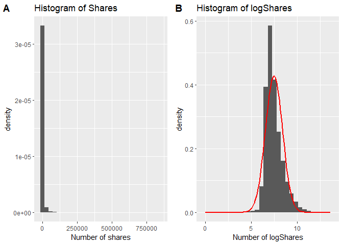
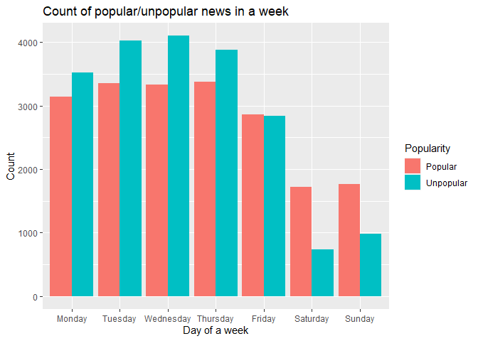
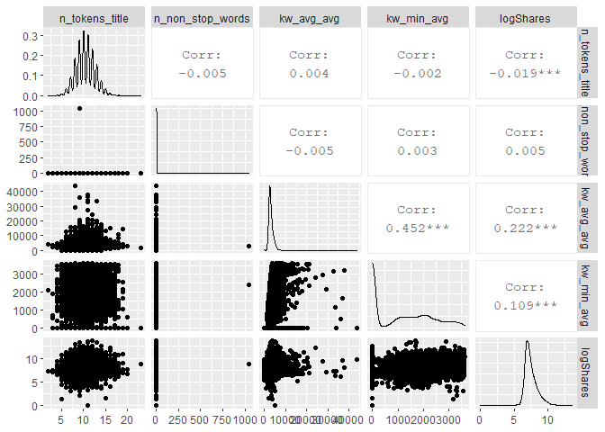
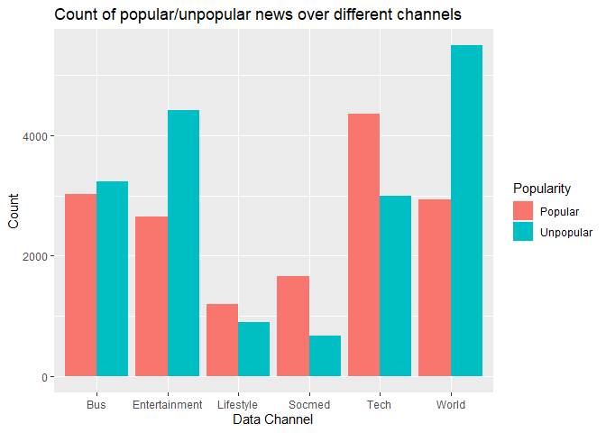
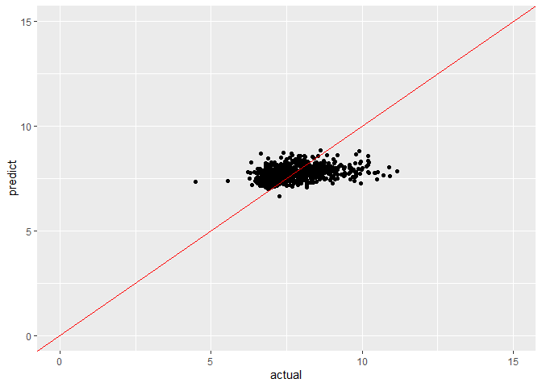
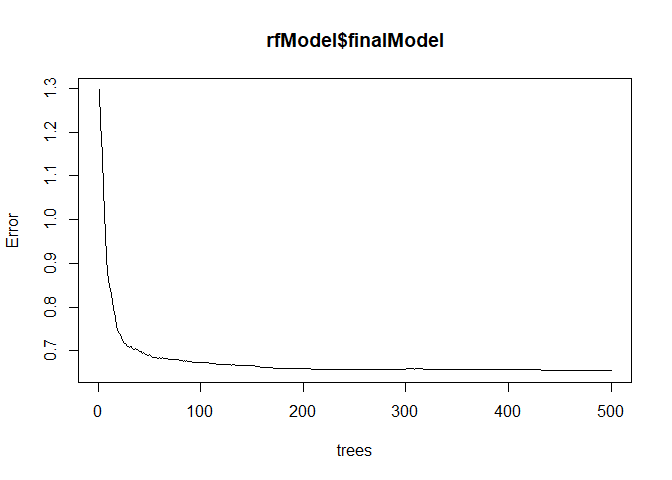

# MODEL SELECTION AND PREDICTION WITH SUNDAY DATA

## 1. Introduction

This project intends to find the best models and set of features to predict the popularity of online news published (number of shares) on each weekday using multiple linear regression and random forest models.  The **Online News Popularity** dataset used for this project is downloaded from [UCI](https://archive.ics.uci.edu/ml/datasets/Online+News+Popularity). This dataset summarizes a heterogeneous set of features about articles published by Mashable in a period of two years.

Records of each weekday was selected and 70% of the subset was used to train models and the left 30% records were used to test the model's prediction accuracy. For linear regression, Backward selection methods was used to select significant features in the model with AIC as selection criterion. For random forest model, 10 fold cross validation was used for training the mode. RMSE(residual mean squared error) were used to select the best model. For comparing the prediction accuracy, an arbitrary cutoff at 1400 was chosen to classify the article as unpopular or popular, the prediction accurate rate of unpopular and popular articles was calculated for two selected models. 

## 2. Data variabels description

The dataset has 61 variables from 39644 articles. The variables describe different aspect of the articles, like words (Number of words of the title/content, average word length, rate of unique/non-stop words of contents), links (number of links, number of links to other articles in Mashable), digital media (number of images/videos), publication time(Day of week/weekend), keywords(number of keywords, words/best/average keywords (#shares), article category), natural language processing(closeness to five LDA topics, title/text polarity/subjectivity, rate and polarity of positive/negative words, absolute subjectivity/polarity levels) and the target (`shares`-number of shares at Mashable). Two variables (`url` and `timedelta`) are non-predictive and are excluded in the models.


## 1. Read in dataset

```r
# download data file and read in to R.
news <- read_csv("D:\\ncsu_sta\\ST558 Data scientist\\Projects\\project2\\OnlineNewsPopularity.csv")
#summary(news)
#colnames(news)
anyNA(news)             # Check missing values.
```

```
## [1] FALSE
```

```r
# Because url and timedelta are not predictors, exclude them form the dataset.
fitData <- news %>% select(-c(url, timedelta))
```
As the website described, the data set does not contain any `NA`.

## 2. Exploratory data analysis

```r
# Convert factor variables to factors
fitData$data_channel_is_lifestyle = as.factor(fitData$data_channel_is_lifestyle)
fitData$data_channel_is_entertainment = as.factor(fitData$data_channel_is_entertainment)
fitData$data_channel_is_bus = as.factor(fitData$data_channel_is_bus)
fitData$data_channel_is_socmed = as.factor(fitData$data_channel_is_socmed)
fitData$data_channel_is_tech = as.factor(fitData$data_channel_is_tech)
fitData$data_channel_is_world = as.factor(fitData$data_channel_is_world)

# plot shares histogram
p1 <- fitData %>% ggplot(aes(x=shares, y=..density..))+
                  geom_histogram(bins=30)+ 
                  labs(x="Number of shares", title="Histogram of Shares")
# Log transform shares.
fitData_log <- fitData %>% mutate(logShares = log(shares)) %>% select(-shares)

p2 <- fitData_log %>% ggplot(aes(x=logShares))+geom_histogram(aes(y=..density..), bins = 30) +
             stat_function(fun=dnorm, args=list(mean=mean(fitData_log$logShares),
                                                sd=sd(fitData_log$logShares)),
                           color = "red", size = 1) +
            labs(x="Number of logShares", title="Histogram of logShares")

plot_grid(p1, p2, labels = "AUTO")
```

<!-- -->

The `shares` variable is severely left skewed, the log transformation `logShares` seems much normal, so use `logShares` as dependent variable for the model selection.

Other people's work had demonstrated that "words" related variables very important like `n_tokens_title, n_unique_tokens`, *the day of week and article category features* are also very important. Here, I make the bar plot of counts of popular and unpopular news (at the cutoff of `1400` shares) over day of week. 


```r
# Count of popular / unpopular news over different days of week.
pop <- news %>% transmute(shares>1400)             # Convert shares into 2 categories at 1400
unpop <- news %>% transmute(!shares>1400)

# Count popular and unpopular articles at each weekday
pop_day <- news %>% select(contains("weekday")) %>% filter(pop) %>% colSums() 
unpop_day <-news %>% select(contains("weekday")) %>% filter(unpop) %>% colSums()

# Create data for plot
plotDay <-data.frame(Popular = pop_day, Unpopular = unpop_day, 
                     weekday=c("Monday", "Tuesday", "Wednesday",
                                         "Thursday", "Friday","Saturday", "Sunday")) %>%
                    gather(key=Popularity, value=Count, 1:2)

# Convert weekday into factor
plotDay$weekday <- factor(plotDay$weekday, levels=(c("Monday", "Tuesday", "Wednesday",
                                         "Thursday", "Friday","Saturday", "Sunday")))

# Plot pop/unpop articles in each weekday
ggplot(data=plotDay, aes(x=weekday, y=Count, fill=Popularity)) + 
  geom_bar(stat="identity", position=position_dodge()) +
  labs(x="Day of a week", y="Count", title="Count of popular/unpopular news in a week")
```

<!-- -->

Indeed, we see different trends of popular news counts or ratios over different days of a week. Those features are truly related to the popularity of news. It is reasonable to subset records for each weekday for training prediction models to see whether bettr prediction can be made. 70% each weekday's records will be random sampled to train the **linear regression and random forest models**. The left 30% will be used to test the models.

## 3. Split data into training and testing datasets.

```r
# Subset week_day_is_* data and remove weekday_is_* and is_weekend variables
dayData <- fitData_log %>% filter(fitData_log[paste0("weekday_is_", tolower(params$weekday))]==1) %>% 
                        select(-contains("week")) 

# Create subset data index and taining and testing datasets.     
index <- createDataPartition(dayData$logShares, p=0.70, list=FALSE)
training <- dayData[ index,]   # %>% dplyr::slice_sample(n=300)
testing  <- dayData[-index,]
```
The subset of Sunday data has 39644 records and 59 features. Random sample of 70% of the data (1917 rows) as the training dataset. The other 30% of the data (820 rows) as the testing dataset.

Firs, to check the correlation between shares and selected features according to other publications. Then popular and unpopular counts are plotted according different article categories. We can check those relationships at the plot. 

```r
# Correlation plot between log shares and selected variables.
GGally::ggpairs(select(fitData_log,c("n_tokens_title","n_non_stop_words",
                                  "kw_avg_avg","kw_min_avg", "logShares")),
                progress=FALSE)
```

<!-- -->

```r
# Convert shares into 2 categories at 1400
pop <- fitData_log %>% transmute(logShares>log(1400)) 
unpop <- fitData_log %>% transmute(!logShares>log(1400))
# Count popular and unpopular records in each category
pop_channel <- fitData_log %>% select(contains("data_channel_is")) %>% 
                            filter(pop) %>% type.convert() %>% colSums()
unpop_channel <- fitData_log %>% select(contains("data_channel_is")) %>% 
                            filter(unpop) %>% type.convert() %>% colSums()
# Combine data for plot
plotChannel <-data.frame(Popular = pop_channel, Unpopular = unpop_channel, 
                         Channel=c("Lifestyle", "Entertainment", "Bus",
                                         "Socmed", "Tech","World")) %>%
                        gather(key=Popularity, value=Count, 1:2)
# Plot counts for each category
ggplot(data=plotChannel, aes(x=Channel, y=Count, fill=Popularity)) + 
  geom_bar(stat="identity", position=position_dodge()) +
  labs(x="Data Channel", y="Count", title="Count of popular/unpopular news over different channels")
```

<!-- -->

## 4. Linear regression model selection

For linear regression, I first fit a **full model** with all predictor features included, then use the backward step-wise selection method (step function) to select important features in the **reduced model** using **AIC** as the major selection criterion. Also, **adjusted R square, AICc, BIC** from two models are also listed.


```r
# Fit the data in a full model with all predictors.
fullModel <- lm(logShares ~., data =training)

# To select better linear regression model with AIC as selection criteria.
redModel <- step(fullModel, direction="backward", trace=0, k=2)

# Compare the adjust R^2, AIC, AICc and BIC for two models.
compareFitStats <- function(fit1, fit2){
  fitStats <- data.frame(fitStat = c("Adj R Square", "AIC", "AICc", "BIC"),
	    col1 = round(c(summary(fit1)$adj.r.squared, AIC(fit1), 
									MuMIn::AICc(fit1), BIC(fit1)), 3),
	    col2 = round(c(summary(fit2)$adj.r.squared, AIC(fit2), 
									MuMIn::AICc(fit2), BIC(fit2)), 3))
	calls <- as.list(match.call())
	calls[[1]] <- NULL
	names(fitStats)[2:3] <- unlist(calls)
	fitStats
}

# Compare the full and reduced models
compareFitStats(fullModel, redModel)
```
The **larger adjusted $R^2$ and smaller, AICc and BIC** also indicate the reduced model is better, choose the reduced model for prediction.

The reduced model have **21** predictors which include features: n_tokens_title, n_tokens_content, n_unique_tokens, num_hrefs, num_self_hrefs, num_keywords, data_channel_is_entertainment, data_channel_is_socmed, data_channel_is_tech, kw_min_min, kw_min_max, kw_min_avg, kw_max_avg, kw_avg_avg, LDA_00, global_rate_negative_words, rate_positive_words, avg_positive_polarity, min_positive_polarity, title_subjectivity, abs_title_subjectivity .

Using the selected linear regression model to predict share in testing dataset and the scatter plot of predicted logShares and the observed logShares seem correlates to each other fairly well.

```r
lmRedPred <- exp(predict(redModel , newdata = testing))

data.frame(actual = testing$logShares, predict = log(lmRedPred)) %>% 
          ggplot(aes(x=actual, y=predict)) + 
          geom_point() + 
          geom_abline(intercept=0, slope=1, col="red") +
          xlim(c(0,15))+ylim(c(0,15))
```

<!-- -->

To better compare the prediction accuracy, cutoff of 1400 shares was chosen to divide artices as popular and unpopular ones. Popularity prediction accurate rate with selected linear regression model was calculated using confusion matrix.


```r
lmPredAccRate <- confusionMatrix(as.factor(ifelse(testing$logShares>log(1400),1,0)), 
                as.factor(ifelse(log(lmRedPred) > log(1400),1,0)))$overall["Accuracy"]
lmPredAccRate
```

```
##  Accuracy 
## 0.6756098
```
For the reduced linear regression model, the prediction accurate rate is 0.6756098 with Sunday data. 

## 5. Random forest model 

For random forest, `caret` package was used. 10 fold cross-validation was used to train the model, *RMSE* is used for the model selection criterion. 


```r
cl <- makePSOCKcluster(7)  # Use parallel computing
registerDoParallel(cl)
# Set train parameters
trControl <- trainControl(method = "repeatedcv", number = 10)

# Fit the random forest model
rfModel <- train(logShares ~., data=training, 
                 method="rf", trControl=trControl, 
                 tuneLength=8)
stopCluster(cl)

# Check select model
rfModel
```

```
## Random Forest 
## 
## 1917 samples
##   50 predictor
## 
## No pre-processing
## Resampling: Cross-Validated (10 fold, repeated 1 times) 
## Summary of sample sizes: 1726, 1725, 1727, 1726, 1725, 1725, ... 
## Resampling results across tuning parameters:
## 
##   mtry  RMSE       Rsquared   MAE      
##    2    0.8057801  0.1201918  0.6175031
##    8    0.8073817  0.1134136  0.6178789
##   15    0.8104263  0.1073500  0.6193109
##   22    0.8112387  0.1064688  0.6192664
##   29    0.8100002  0.1092903  0.6179264
##   36    0.8106733  0.1079285  0.6181443
##   43    0.8126812  0.1046765  0.6194395
##   50    0.8135486  0.1031819  0.6206948
## 
## RMSE was used to select the optimal model using the smallest value.
## The final value used for the model was mtry = 2.
```

```r
plot(rfModel)
```

<!-- -->

```r
plot(rfModel$finalModel)
```

<!-- -->

The final model selected from the random forest methods has mTry = 2  which is the number of variables available for splitting at each tree node. 


```r
# Predict with testing dataset.
rfPred<- exp(predict(rfModel, newdata = testing, type="raw"))

# Scatter plot to show the prediction and actual logShares values.
data.frame(actual = testing$logShares, predict = log(rfPred)) %>% 
          ggplot(aes(x=actual, y=predict)) + 
          geom_point() + 
          geom_abline(intercept=0, slope=1, col="red") +
          xlim(c(0,15))+ylim(c(0,15))
```

<!-- -->

```r
# Using cutoff of 1400 shares, as high shares and low shares articles
# prediction accruate rate with selected linear regression model using confusion matrix.
rfPredAccRate <- confusionMatrix(as.factor(ifelse(testing$logShares>log(1400),1,0)), 
                as.factor(ifelse(log(rfPred) > log(1400),1,0)))$overall["Accuracy"]
rfPredAccRate
```

```
##  Accuracy 
## 0.6621951
```


Scatter plot of predicted logShares and the observed logShares shows fairly good correlation. 
For the random forest model, the prediction accurate rate is 0.6621951 with Sunday data. 


## 6. Compare two models

```r
fitSummary <- unlist(c(nrow(dayData), nrow(training), nrow(testing), 
                       summary(redModel)$df[1]-1, round(lmPredAccRate,2),
                       rfModel$finalModel["mtry"] , round(rfPredAccRate,2)))
 
#assign(resultSummary[,params$weekday], fitSummary, envir = .GlobalEnv)
assign(paste0(params$weekday), fitSummary, envir = .GlobalEnv)


knitr::kable(c("Linear Model"=lmPredAccRate, "Random Forest"=rfPredAccRate), col.names="Prediction Accurate Rate")
```


|                       | Prediction Accurate Rate|
|:----------------------|------------------------:|
|Linear Model.Accuracy  |                0.6756098|
|Random Forest.Accuracy |                0.6621951|
For Sunday data, the linear model model do a better job in the term of prediction accuracy.


