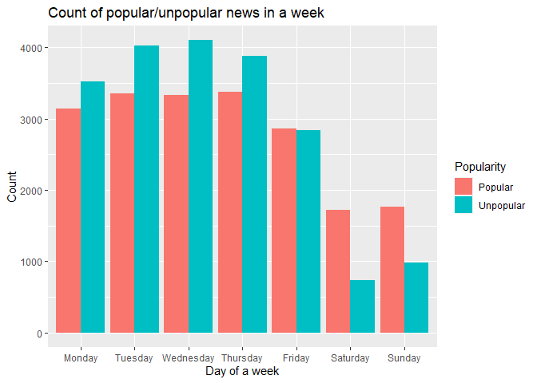
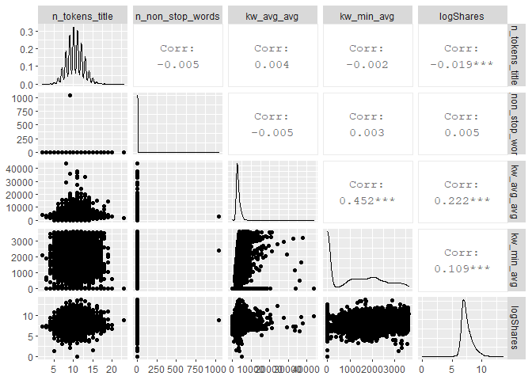
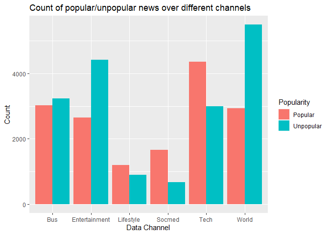
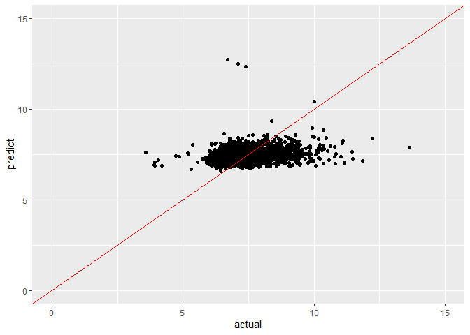
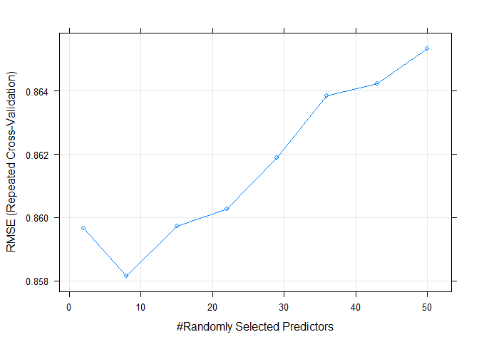
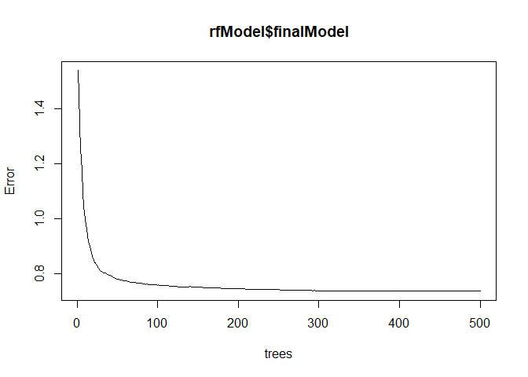

Project2
================
Tao Sun
6/25/2020

# MODEL SELECTION AND PREDICTION WITH WEDNESDAY DATA

## 1\. Introduction

This project intends to find the best models and set of features to
predict the popularity of online news published (number of shares) on
each weekday using multiple linear regression and random forest models.
The **Online News Popularity** dataset used for this project is
downloaded from
[UCI](https://archive.ics.uci.edu/ml/datasets/Online+News+Popularity).
This dataset summarizes a heterogeneous set of features about articles
published by Mashable in a period of two years.

Records of each weekday was selected and 70% of the subset was used to
train models and the left 30% records were used to test the model’s
prediction accuracy. For linear regression, Backward selection methods
was used to select significant features in the model with AIC as
selection criterion. For random forest model, 10 fold cross validation
was used for training the mode. RMSE(residual mean squared error) were
used to select the best model. For comparing the prediction accuracy, an
arbitrary cutoff at 1400 was chosen to classify the article as unpopular
or popular, the prediction accurate rate of unpopular and popular
articles was calculated for two selected models.

## 2\. Data variabels description

The dataset has 61 variables from 39644 articles. The variables describe
different aspect of the articles, like words (Number of words of the
title/content, average word length, rate of unique/non-stop words of
contents), links (number of links, number of links to other articles in
Mashable), digital media (number of images/videos), publication time(Day
of week/weekend), keywords(number of keywords, words/best/average
keywords (\#shares), article category), natural language
processing(closeness to five LDA topics, title/text
polarity/subjectivity, rate and polarity of positive/negative words,
absolute subjectivity/polarity levels) and the target (`shares`-number
of shares at Mashable). Two variables (`url` and `timedelta`) are
non-predictive and are excluded in the models.

## 1\. Read in dataset

``` r
# download data file and read in to R.
news <- read_csv("D:\\ncsu_sta\\ST558 Data scientist\\Projects\\project2\\OnlineNewsPopularity.csv")
#summary(news)
#colnames(news)
anyNA(news)             # Check missing values.
```

    ## [1] FALSE

``` r
# Because url and timedelta are not predictors, exclude them form the dataset.
fitData <- news %>% select(-c(url, timedelta))
```

As the website described, the data set does not contain any `NA`.

## 2\. Exploratory data analysis

``` r
# Convert factor variables to factors
fitData$data_channel_is_lifestyle = as.factor(fitData$data_channel_is_lifestyle)
fitData$data_channel_is_entertainment = as.factor(fitData$data_channel_is_entertainment)
fitData$data_channel_is_bus = as.factor(fitData$data_channel_is_bus)
fitData$data_channel_is_socmed = as.factor(fitData$data_channel_is_socmed)
fitData$data_channel_is_tech = as.factor(fitData$data_channel_is_tech)
fitData$data_channel_is_world = as.factor(fitData$data_channel_is_world)

# plot shares histogram
p1 <- fitData %>% ggplot(aes(x=shares, y=..density..))+
                  geom_histogram(bins=30)+ 
                  labs(x="Number of shares", title="Histogram of Shares")
# Log transform shares.
fitData_log <- fitData %>% mutate(logShares = log(shares)) %>% select(-shares)

p2 <- fitData_log %>% ggplot(aes(x=logShares))+geom_histogram(aes(y=..density..), bins = 30) +
             stat_function(fun=dnorm, args=list(mean=mean(fitData_log$logShares),
                                                sd=sd(fitData_log$logShares)),
                           color = "red", size = 1) +
            labs(x="Number of logShares", title="Histogram of logShares")

plot_grid(p1, p2, labels = "AUTO")
```

<!-- -->

The `shares` variable is severely left skewed, the log transformation
`logShares` seems much normal, so use `logShares` as dependent variable
for the model selection.

Other people’s work had demonstrated that “words” related variables very
important like `n_tokens_title, n_unique_tokens`, *the day of week and
article category features* are also very important. Here, I make the bar
plot of counts of popular and unpopular news (at the cutoff of `1400`
shares) over day of week.

``` r
# Count of popular / unpopular news over different days of week.
pop <- news %>% transmute(shares>1400)             # Convert shares into 2 categories at 1400
unpop <- news %>% transmute(!shares>1400)

# Count popular and unpopular articles at each weekday
pop_day <- news %>% select(contains("weekday")) %>% filter(pop) %>% colSums() 
unpop_day <-news %>% select(contains("weekday")) %>% filter(unpop) %>% colSums()

# Create data for plot
plotDay <-data.frame(Popular = pop_day, Unpopular = unpop_day, 
                     weekday=c("Monday", "Tuesday", "Wednesday",
                                         "Thursday", "Friday","Saturday", "Sunday")) %>%
                    gather(key=Popularity, value=Count, 1:2)

# Convert weekday into factor
plotDay$weekday <- factor(plotDay$weekday, levels=(c("Monday", "Tuesday", "Wednesday",
                                         "Thursday", "Friday","Saturday", "Sunday")))

# Plot pop/unpop articles in each weekday
ggplot(data=plotDay, aes(x=weekday, y=Count, fill=Popularity)) + 
  geom_bar(stat="identity", position=position_dodge()) +
  labs(x="Day of a week", y="Count", title="Count of popular/unpopular news in a week")
```

<!-- -->

Indeed, we see different trends of popular news counts or ratios over
different days of a week. Those features are truly related to the
popularity of news. It is reasonable to subset records for each weekday
for training prediction models to see whether bettr prediction can be
made. 70% each weekday’s records will be random sampled to train the
**linear regression and random forest models**. The left 30% will be
used to test the models.

## 3\. Split data into training and testing datasets.

``` r
# Subset week_day_is_* data and remove weekday_is_* and is_weekend variables
dayData <- fitData_log %>% filter(fitData_log[paste0("weekday_is_", tolower(params$weekday))]==1) %>% 
                        select(-contains("week")) 

# Create subset data index and taining and testing datasets.     
index <- createDataPartition(dayData$logShares, p=0.70, list=FALSE)
training <- dayData[ index,]   # %>% dplyr::slice_sample(n=300)
testing  <- dayData[-index,]
```

The subset of Wednesday data has 39644 records and 59 features. Random
sample of 70% of the data (5207 rows) as the training dataset. The other
30% of the data (2228 rows) as the testing dataset.

Firs, to check the correlation between shares and selected features
according to other publications. Then popular and unpopular counts are
plotted according different article categories. We can check those
relationships at the plot.

``` r
# Correlation plot between log shares and selected variables.
GGally::ggpairs(select(fitData_log,c("n_tokens_title","n_non_stop_words",
                                  "kw_avg_avg","kw_min_avg", "logShares")),
                progress=FALSE)
```

<!-- -->

``` r
# Convert shares into 2 categories at 1400
pop <- fitData_log %>% transmute(logShares>log(1400)) 
unpop <- fitData_log %>% transmute(!logShares>log(1400))
# Count popular and unpopular records in each category
pop_channel <- fitData_log %>% select(contains("data_channel_is")) %>% 
                            filter(pop) %>% type.convert() %>% colSums()
unpop_channel <- fitData_log %>% select(contains("data_channel_is")) %>% 
                            filter(unpop) %>% type.convert() %>% colSums()
# Combine data for plot
plotChannel <-data.frame(Popular = pop_channel, Unpopular = unpop_channel, 
                         Channel=c("Lifestyle", "Entertainment", "Bus",
                                         "Socmed", "Tech","World")) %>%
                        gather(key=Popularity, value=Count, 1:2)
# Plot counts for each category
ggplot(data=plotChannel, aes(x=Channel, y=Count, fill=Popularity)) + 
  geom_bar(stat="identity", position=position_dodge()) +
  labs(x="Data Channel", y="Count", title="Count of popular/unpopular news over different channels")
```

<!-- -->

## 4\. Linear regression model selection

For linear regression, I first fit a **full model** with all predictor
features included, then use the backward step-wise selection method
(step function) to select important features in the **reduced model**
using **AIC** as the major selection criterion. Also, **adjusted R
square, AICc, BIC** from two models are also listed.

``` r
# Fit the data in a full model with all predictors.
fullModel <- lm(logShares ~., data =training)

# To select better linear regression model with AIC as selection criteria.
redModel <- step(fullModel, direction="backward", trace=0, k=2)

# Compare the adjust R^2, AIC, AICc and BIC for two models.
compareFitStats <- function(fit1, fit2){
  fitStats <- data.frame(fitStat = c("Adj R Square", "AIC", "AICc", "BIC"),
        col1 = round(c(summary(fit1)$adj.r.squared, AIC(fit1), 
                                    MuMIn::AICc(fit1), BIC(fit1)), 3),
        col2 = round(c(summary(fit2)$adj.r.squared, AIC(fit2), 
                                    MuMIn::AICc(fit2), BIC(fit2)), 3))
    calls <- as.list(match.call())
    calls[[1]] <- NULL
    names(fitStats)[2:3] <- unlist(calls)
    fitStats
}

# Compare the full and reduced models
compareFitStats(fullModel, redModel)
```

The **larger adjusted \(R^2\) and smaller, AICc and BIC** also indicate
the reduced model is better, choose the reduced model for prediction.

The reduced model have **27** predictors which include features:
n\_tokens\_content, num\_hrefs, num\_self\_hrefs, num\_imgs,
data\_channel\_is\_lifestyle, data\_channel\_is\_entertainment,
data\_channel\_is\_bus, data\_channel\_is\_socmed,
data\_channel\_is\_world, kw\_min\_min, kw\_avg\_min, kw\_min\_max,
kw\_max\_max, kw\_min\_avg, kw\_max\_avg, kw\_avg\_avg,
self\_reference\_min\_shares, self\_reference\_avg\_sharess, LDA\_00,
LDA\_02, LDA\_03, global\_sentiment\_polarity,
global\_rate\_negative\_words, avg\_positive\_polarity,
avg\_negative\_polarity, abs\_title\_subjectivity,
abs\_title\_sentiment\_polarity .

Using the selected linear regression model to predict share in testing
dataset and the scatter plot of predicted logShares and the observed
logShares seem correlates to each other fairly well.

``` r
lmRedPred <- exp(predict(redModel , newdata = testing))

data.frame(actual = testing$logShares, predict = log(lmRedPred)) %>% 
          ggplot(aes(x=actual, y=predict)) + 
          geom_point() + 
          geom_abline(intercept=0, slope=1, col="red") +
          xlim(c(0,15))+ylim(c(0,15))
```

<!-- -->

To better compare the prediction accuracy, cutoff of 1400 shares was
chosen to divide artices as popular and unpopular ones. Popularity
prediction accurate rate with selected linear regression model was
calculated using confusion matrix.

``` r
lmPredAccRate <- confusionMatrix(as.factor(ifelse(testing$logShares>log(1400),1,0)), 
                as.factor(ifelse(log(lmRedPred) > log(1400),1,0)))$overall["Accuracy"]
lmPredAccRate
```

    ##  Accuracy 
    ## 0.6113106

For the reduced linear regression model, the prediction accurate rate is
0.6113106 with Wednesday data.

## 5\. Random forest model

For random forest, `caret` package was used. 10 fold cross-validation
was used to train the model, *RMSE* is used for the model selection
criterion.

``` r
cl <- makePSOCKcluster(7)  # Use parallel computing
registerDoParallel(cl)
# Set train parameters
trControl <- trainControl(method = "repeatedcv", number = 10)

# Fit the random forest model
rfModel <- train(logShares ~., data=training, 
                 method="rf", trControl=trControl, 
                 tuneLength=8)
stopCluster(cl)

# Check select model
rfModel
```

    ## Random Forest 
    ## 
    ## 5207 samples
    ##   50 predictor
    ## 
    ## No pre-processing
    ## Resampling: Cross-Validated (10 fold, repeated 1 times) 
    ## Summary of sample sizes: 4687, 4686, 4688, 4686, 4687, 4686, ... 
    ## Resampling results across tuning parameters:
    ## 
    ##   mtry  RMSE       Rsquared   MAE      
    ##    2    0.8596600  0.1568179  0.6397937
    ##    8    0.8581566  0.1531380  0.6381209
    ##   15    0.8597311  0.1500358  0.6392590
    ##   22    0.8602761  0.1490101  0.6398990
    ##   29    0.8618891  0.1462088  0.6404995
    ##   36    0.8638407  0.1428250  0.6415454
    ##   43    0.8642258  0.1417897  0.6425926
    ##   50    0.8653264  0.1401978  0.6434701
    ## 
    ## RMSE was used to select the optimal model using the smallest value.
    ## The final value used for the model was mtry = 8.

``` r
plot(rfModel)
```

<!-- -->

``` r
plot(rfModel$finalModel)
```

<!-- -->

The final model selected from the random forest methods has mTry = 8
which is the number of variables available for splitting at each tree
node.

``` r
# Predict with testing dataset.
rfPred<- exp(predict(rfModel, newdata = testing, type="raw"))

# Scatter plot to show the prediction and actual logShares values.
data.frame(actual = testing$logShares, predict = log(rfPred)) %>% 
          ggplot(aes(x=actual, y=predict)) + 
          geom_point() + 
          geom_abline(intercept=0, slope=1, col="red") +
          xlim(c(0,15))+ylim(c(0,15))
```

<!-- -->

``` r
# Using cutoff of 1400 shares, as high shares and low shares articles
# prediction accruate rate with selected linear regression model using confusion matrix.
rfPredAccRate <- confusionMatrix(as.factor(ifelse(testing$logShares>log(1400),1,0)), 
                as.factor(ifelse(log(rfPred) > log(1400),1,0)))$overall["Accuracy"]
rfPredAccRate
```

    ##  Accuracy 
    ## 0.6211849

Scatter plot of predicted logShares and the observed logShares shows
fairly good correlation. For the random forest model, the prediction
accurate rate is 0.6211849 with Wednesday data.

## 6\. Compare two models

``` r
fitSummary <- unlist(c(nrow(dayData), nrow(training), nrow(testing), 
                       summary(redModel)$df[1]-1, round(lmPredAccRate,2),
                       rfModel$finalModel["mtry"] , round(rfPredAccRate,2)))
 
#assign(resultSummary[,params$weekday], fitSummary, envir = .GlobalEnv)
assign(paste0(params$weekday), fitSummary, envir = .GlobalEnv)


knitr::kable(c("Linear Model"=lmPredAccRate, "Random Forest"=rfPredAccRate), col.names="Prediction Accurate Rate")
```

|                        | Prediction Accurate Rate |
| :--------------------- | -----------------------: |
| Linear Model.Accuracy  |                0.6113106 |
| Random Forest.Accuracy |                0.6211849 |

For Wednesday data, the random forest model do a better job in the term
of prediction accuracy.
